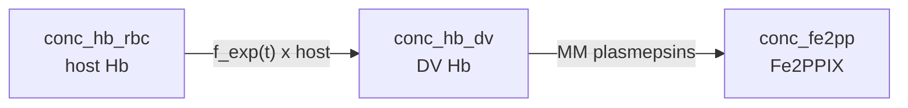

# Degradation sandbox

**Code:** [`haem_kinetics/models/degradation.py`](../../haem_kinetics/models/degradation.py)  
**Up:** [Model index](../models.md) · **Next:** [Model 1](model1.md)

Sandbox for testing **Hb uptake** and **enzymatic release of Fe(II)**. There is no Fe(III) or haemozoin chemistry. Uses the same `variable_dv_volume` bookkeeping as Models 1–3.

---

## Why this model exists

Before committing to full Fe speciation, we needed a place to try **transport laws** (linear vs exponential host→DV delivery) and see whether plasmepsin MM digestion produces Fe(II) on a sensible schedule. Degradation is that sandbox: only `conc_hb_dv`, `conc_fe2pp`, and host.

**Important quirk (intentional diagnostic, not a bug to “fix” here):** the Hb ODE currently adds uptake but **does not subtract** digestion, while Fe(II) still forms at `v_dig`. That lets you inspect uptake curves without Hb collapsing, at the cost of breaking digested-Hb mass balance (total Fe can exceed ~106 fg). Use this model for uptake-schedule experiments only — not for closed Fe accounting.

---

## Process schematic



**Note:** the active sandbox path sets Hb *removal* to zero in the Hb ODE while still allowing digestion to feed Fe(II). That creates Fe without consuming DV Hb — treat outputs as diagnostic for uptake schedules, not closed mass balance of digested Hb.

---

## State variables

| Symbol | Meaning | Units |
|--------|---------|-------|
| `conc_hb_dv` | Hb in DV (haem-equivalents) | M |
| `conc_fe2pp` | Free Fe(II)PPIX | M |
| `conc_hb_rbc` | Remaining host Hb | M (RBC basis) |

Callers pass `[Hb_DV, Fe2]`; `run()` appends remaining host.

Derived for plotting: `conc_hb_dv_obs = conc_hb_dv − conc_fe2pp` (historical comparison trick). `conc_hz` is forced to 0 after solve.

---

## Governing equations

Auxiliary rates (`t` in minutes from 16 h):

```text
# Fractional exponential growth (uptake / enzyme clock)
f_exp(t) = a · b · exp(b · t)     a = 0.1578,  b = 0.001102

# Host → DV Hb uptake (M/min on V_DV(t))
v_up = f_exp(t) · [Hb]_RBC · V_RBC / V_DV(t)

# Effective protease concentration
[E]_i,eff = f_exp(t) · n_E,i / V_DV(t)     i ∈ {plm_1, plm_2, hap, plm_4}

# Haem release from Hb (MM sum; 4 haem-eq per tetramer)
v_dig = 4 · Σ_i  (60 · kcat_i) · [E]_i,eff · [Hb]_tet
                     / (Km_i + [Hb]_tet)

dil(C) = − C · (dV_DV/dt) / V_DV
```

ODEs (as implemented):

```text
# DV haemoglobin (digestion term deliberately omitted)
d[Hb]_DV / dt  = v_up + dil([Hb]_DV)

# Free Fe(II)PPIX
d[Fe(II)] / dt = v_dig + dil([Fe(II)])

# Remaining host RBC Hb
d[Hb]_RBC / dt = − v_up · V_DV(t) / V_RBC
```

---

## Constants used

| Constant | Value | Units | Description |
|----------|------:|-------|-------------|
| `a` | 0.1578 | — | Prefactor in fractional exponential growth `f_exp(t)` |
| `b` | 0.001102 | min⁻¹ | Rate constant in fractional exponential growth `f_exp(t)` |
| `V_RBC` | 90×10⁻¹⁵ | L | Volume of the host red blood cell |
| `V_DV,ref` | 1×10⁻¹⁵ | L | Reference DV volume (init API and PaxDB `n_E`) |
| `V_DV(t)` | variable | L | Shared lumen bookkeeping (`variable_dv_volume`; same fg conversion as Models 1–3) |
| `N_A` | 6.022×10²³ | mol⁻¹ | Avogadro's number |
| `N_prot` | 1.9×10⁸ | — | Average number of proteins per *P. falciparum* cell |

Enzyme inputs for `v_dig`. `[E]` is **derived** (`ppm × 10⁻⁶ × N_prot / (N_A · V_DV)`), not an independent constant; code converts `kcat` to min⁻¹ as `60 × kcat[s⁻¹]`. Full citations: [`docs/enzyme_kinetics.md`](../enzyme_kinetics.md).

| Constant | Value | Units | Description |
|----------|------:|-------|-------------|
| `ppm_plm_1` | 752 | — | PaxDB Tao 2014 Dd2 abundance of plasmepsin-1 (input; `[E]` derived) |
| `kcat_plm_1` | 2.3 | s⁻¹ | Luker/Banerjee α33–34 peptide (native PM I) |
| `Km_plm_1` | 0.49×10⁻⁶ | M | Luker/Banerjee α33–34 peptide (native PM I) |
| `ppm_plm_2` | 1204 | — | PaxDB Tao 2014 Dd2 abundance of plasmepsin-2 (input; `[E]` derived) |
| `kcat_plm_2` | 11 | s⁻¹ | Luker/Banerjee α33–34 peptide (native PM II) |
| `Km_plm_2` | 2.6×10⁻⁶ | M | Luker/Banerjee α33–34 peptide (native PM II) |
| `ppm_hap` | 1373 | — | PaxDB Tao 2014 Dd2 abundance of HAP (input; `[E]` derived) |
| `kcat_hap` | 0.05 | s⁻¹ | Banerjee 2002 Table 1 (native HAP, α33–34) |
| `Km_hap` | 0.29×10⁻⁶ | M | Banerjee 2002 Table 1 (native HAP, α33–34) |
| `ppm_plm_4` | 3139 | — | PaxDB Tao 2014 Dd2 abundance of plasmepsin-4 (input; `[E]` derived) |
| `kcat_plm_4` | 1.05 | s⁻¹ | Banerjee 2002 Table 1 (recombinant PM IV, α33–34) |
| `Km_plm_4` | 0.33×10⁻⁶ | M | Banerjee 2002 Table 1 (recombinant PM IV, α33–34) |

## Assumptions

- SOD / Fe(III) cycle irrelevant (no Fe(III) states).
- Enzyme levels scale with the same `f_exp(t)` used for uptake.
- Shared `variable_dv_volume` for M ↔ fg conversion (bookkeeping).

---

## Typical use

```python
from haem_kinetics.models.degradation import Degradation

Degradation().run(
    t=[0, 1700],
    init=[0.018, 0.0],
    t_eval=range(0, 1700, 20),
    plot='examples/degradation.png',
    method='BDF',
)
```

---

## Relation to other models

Degradation is an uptake / Fe(II)-release sandbox only. For closed Fe speciation with oxidation and haemozoin, continue to [Model 1](model1.md).

Speciation fit metrics (Hb / Hm / Hz vs Garnie Dd2) are **not** reported here: this model has no Fe(III)/Hz path and is mass-imbalanced by design. See [models.md](../models.md#fit-vs-garnie-dd2-tracking).
