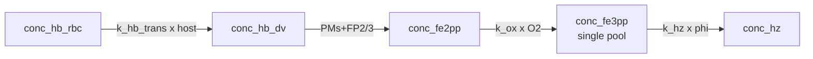

# Legacy Model 2

**Code:** [`haem_kinetics/models/legacy/model2.py`](../../../haem_kinetics/models/legacy/model2.py)  
**Up:** [Legacy index](README.md) · [Active models](../../models.md) · **Prev:** [Model 1](../model1.md) · **Next:** [Legacy Model 3](model3.md)

Same transport and protease network as Model 1, plus a **lipid sequestration factor `φ`** applied to Fe(III)-involving rates.

---

## What changed vs Model 1 (and why)

**Problem in Model 1:** experiment shows a persistent basal free-haem (Hm) fraction through the trophozoite window, but Model 1’s single Fe³⁺ pool crystallizes at the full lipid-assay `k_hz` (0.12 min⁻¹). On the simulation timescale that drains free Fe³⁺ into Hz too aggressively — there is no standing “non-Hz haem” reservoir.

**Change:** keep one Fe³⁺ ODE species, but multiply Fe³⁺-consuming rates by an aqueous fraction `φ` ≈ 0.133 derived from lipid volume fraction and `K_partition`:

| Rate | Model 1 | Model 2 |
|------|---------|---------|
| `v_hz` | `k_hz · [Fe(III)]` | `k_hz · φ · [Fe(III)]` |
| `v_red` (if `[O2−]` ≠ 0) | without `φ` | with `φ` |
| Uptake / proteases / oxidation | — | Unchanged |

**Intent:** interpret `φ` as “only the aqueous-like fraction of Fe³⁺ is reactive,” so most Fe³⁺ is effectively sequestered and free haem can linger.

**Caveat:** `k_hz` itself was measured in **lipid-mediated** β-haematin assays (Egan et al.). Slowing Hz by `φ` < 1 treats lipid as a *sink that inhibits* crystallization — the wrong chemical sign if lipids *catalyse* Hz. This model keeps the rate-hack anyway as a first attempt to leave basal free haem.

---

## Process schematic



```text
φ = (1 − f_lip) / (1 + f_lip + f_lip × K_partition) ≈ 0.133
```

---

## State variables

| Symbol | Meaning |
|--------|---------|
| `conc_hb_dv` | DV haemoglobin (haem-eq, M) |
| `conc_fe2pp` | Fe(II)PPIX |
| `conc_fe3pp` | Fe(III)PPIX (single pool) |
| `conc_hz` | Haemozoin |
| `conc_hb_rbc` | Remaining host Hb (appended by `run()`) |

Init API: `[Hb_DV, Fe2, Fe3, Hz]`.

---

## Governing equations

Auxiliary rates:

```text
# Host → DV Hb uptake (linear; M/min on V_DV)
v_up = k_hb_trans · [Hb]_RBC

# Effective protease concentration (constant PaxDB [E]; PMs + falcipains)
[E]_i,eff = [E]_i
i ∈ {plm_1, plm_2, hap, plm_4, fp_2, fp_3}

# Haem release from Hb (MM sum; 4 haem-eq per tetramer)
v_dig = 4 · Σ_i  (60 · kcat_i) · [E]_i,eff · [Hb]_tet
                     / (Km_i + [Hb]_tet)

# Fe(II) → Fe(III) oxidation
v_ox  = k_fe2_ox · [Fe(II)] · [O2]

# Aqueous fraction of Fe(III) (lipid sequestration factor)
φ = (1 − f_lip) / (1 + f_lip + f_lip · K_partition)

# Fe(III) → Fe(II) reduction (off: [O2−] = 0; φ-scaled)
v_red = k_fe3_red · φ · [Fe(III)] · [O2−]

# Haemozoin formation (φ-scaled)
v_hz  = k_hz · φ · [Fe(III)]
```

ODEs:

```text
# DV haemoglobin
d[Hb]_DV / dt   = v_up − v_dig

# Free Fe(II)PPIX
d[Fe(II)] / dt  = v_dig + v_red − v_ox

# Free Fe(III)PPIX
d[Fe(III)] / dt = v_ox − v_red − v_hz

# Haemozoin
d[Hz] / dt      = v_hz

# Remaining host RBC Hb
d[Hb]_RBC / dt  = − v_up · V_DV / V_RBC
```

---

## Constants used

| Constant | Value | Units | Description |
|----------|------:|-------|-------------|
| `k_hb_trans` | ≈ 3.79×10⁻⁴ | min⁻¹ | First-order coefficient for host → DV Hb uptake |
| `V_RBC` | 90×10⁻¹⁵ | L | Volume of the host red blood cell |
| `V_DV` | 1×10⁻¹⁵ | L | Fixed digestive-vacuole volume used for M ↔ fg conversion |
| `N_A` | 6.022×10²³ | mol⁻¹ | Avogadro's number |
| `N_prot` | 1.9×10⁸ | — | Average number of proteins per *P. falciparum* cell |
| `k_fe2_ox` | 193800 | min⁻¹ | Rate constant for Fe(II)PPIX oxidation by O₂ |
| `[O2]` | 1×10⁻³ | M | Dissolved oxygen concentration in the DV |
| `k_fe3_red` | 180×10⁻⁹ | — | Rate constant for Fe(III)PPIX reduction by O₂⁻ (inactive when `[O2−]` = 0) |
| `[O2−]` | 0 | M | Superoxide concentration (taken as zero due to SOD) |
| `k_hz` | 0.12 | min⁻¹ | First-order rate constant for haemozoin formation from Fe(III) |
| `f_lip` | 0.016 | — | Fractional volume of lipid nanospheres relative to the DV |
| `K_partition` | 398 | — | Equilibrium partition coefficient of Fe(III)PPIX into lipid |
| `φ` | ≈ 0.133 | — | Aqueous fraction of Fe(III) at partition equilibrium; multiplies Fe(III) rates |

Enzyme inputs for `v_dig`. `[E]` is **derived** (`ppm × 10⁻⁶ × N_prot / (N_A · V_DV)`), not an independent constant; code converts `kcat` to min⁻¹ as `60 × kcat[s⁻¹]`. Full citations: [`docs/enzyme_kinetics.md`](../enzyme_kinetics.md).

| Constant | Value | Units | Description |
|----------|------:|-------|-------------|
| `ppm_plm_1` | 752 | — | PaxDB Tao 2014 Dd2 abundance of plasmepsin-1 (input; `[E]` derived) |
| `kcat_plm_1` | 2.3 | s⁻¹ | Luker/Banerjee α33–34 peptide (native PM I) |
| `Km_plm_1` | 0.49×10⁻⁶ | M | Luker/Banerjee α33–34 peptide (native PM I) |
| `ppm_plm_2` | 1204 | — | PaxDB Tao 2014 Dd2 abundance of plasmepsin-2 (input; `[E]` derived) |
| `kcat_plm_2` | 11 | s⁻¹ | Luker/Banerjee α33–34 peptide (native PM II) |
| `Km_plm_2` | 2.6×10⁻⁶ | M | Luker/Banerjee α33–34 peptide (native PM II) |
| `ppm_hap` | 1373 | — | PaxDB Tao 2014 Dd2 abundance of HAP (input; `[E]` derived) |
| `kcat_hap` | 0.05 | s⁻¹ | Banerjee 2002 Table 1 (native HAP, α33–34) |
| `Km_hap` | 0.29×10⁻⁶ | M | Banerjee 2002 Table 1 (native HAP, α33–34) |
| `ppm_plm_4` | 3139 | — | PaxDB Tao 2014 Dd2 abundance of plasmepsin-4 (input; `[E]` derived) |
| `kcat_plm_4` | 1.05 | s⁻¹ | Banerjee 2002 Table 1 (recombinant PM IV, α33–34) |
| `Km_plm_4` | 0.33×10⁻⁶ | M | Banerjee 2002 Table 1 (recombinant PM IV, α33–34) |
| `ppm_fp_2` | 20.2 | — | PaxDB Tao 2014 Dd2 abundance of falcipain-2a (input; `[E]` derived) |
| `kcat_fp_2` | 0.79 | s⁻¹ | Ramjee 2006 best FP-2 FRET peptide |
| `Km_fp_2` | 0.9×10⁻⁶ | M | Ramjee 2006 best FP-2 FRET peptide |
| `ppm_fp_3` | 23.5 | — | PaxDB Tao 2014 Dd2 abundance of falcipain-3 (input; `[E]` derived) |
| `kcat_fp_3` | 0.204 | s⁻¹ | Ramjee 2006 FP-3 Leu-Arg FRET peptide |
| `Km_fp_3` | 4.0×10⁻⁶ | M | Ramjee 2006 FP-3 Leu-Arg FRET peptide |

## Assumptions and critique

- Partitioning is a **rate multiplier**, not separate aqueous/lipid concentrations — you cannot plot lipid vs aqueous Fe³⁺.
- Multiplying lipid-assay `k_hz` by `φ` < 1 is chemically inconsistent with lipid-catalysed β-haematin.
- Same numerical caution as Model 1: full PaxDB `[E]` from `t` = 0 still digests DV Hb almost instantly.

---

## Example

```python
from haem_kinetics.models.legacy.model2 import Model2

Model2().run(
    t=[0, 1700],
    init=[0.018, 0.0, 0.0, 0.36],
    t_eval=range(0, 1700, 20),
    plot='examples/model2.png',
    method='BDF',
)
```
