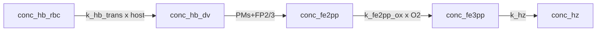

# Model 1

**Code:** [`haem_kinetics/models/model1.py`](../../haem_kinetics/models/model1.py)  
**Up:** [Model index](../models.md) · **Next:** [Model 2](model2.md)

Baseline full speciation model: **linear** host→DV uptake, haem-releasing proteases (PMs + falcipain-2/3), fast Fe(II) oxidation, and first-order haemozoin formation. No lipid chemistry. Variable `V_DV(t)` (`variable_dv_volume`) is **shared bookkeeping** (dilution, `[E] = n_E / V(t)`, fg = `C·V`) — not this model’s mechanistic change.

---

## Why this model exists

Model 1 is the **minimal closed iron path** from host Hb → DV Hb → Fe(II) → Fe(III) → Hz, with host mass balance. It provides a chemically simple baseline: linear uptake, DV plasmepsins **and** falcipain-2/3 at constant PaxDB levels, a single Fe(III) pool, and crystallization at literature `k_hz`.

**What that implies vs experiment (Dd2):** linear uptake leaves most Fe in the host (~84 fg); DV Hb collapses almost immediately (protease capacity ≫ uptake); Hz stays near the seed; there is **no mechanism for a standing basal free-haem (Hm) pool** of the size Garnie reports. Model 2 addresses uptake first.

---

## Process schematic



---

## State variables

| Symbol | Meaning |
|--------|---------|
| `conc_hb_dv` | DV haemoglobin (haem-eq, M) |
| `conc_fe2pp` | Fe(II)PPIX |
| `conc_fe3pp` | Fe(III)PPIX (single pool) |
| `conc_hz` | Haemozoin |
| `conc_hb_rbc` | Remaining host Hb (appended by `run()`) |

Init API: `[Hb_DV, Fe2, Fe3, Hz]`.

---

## Governing equations

Auxiliary rates:

```text
# Host → DV Hb uptake (linear; M/min on V_DV(t))
# k_hb_trans is the 1 fL-reference coefficient; V_ref/V keeps mole delivery independent of lumen size
v_up = k_hb_trans · [Hb]_RBC · V_DV,ref / V_DV(t)

# Effective protease concentration (PaxDB amount; molarity follows V(t))
[E]_i,eff = n_E,i / V_DV(t)
i ∈ {plm_1, plm_2, hap, plm_4, fp_2, fp_3}

# Haem release from Hb (MM sum; 4 haem-eq per tetramer)
v_dig = 4 · Σ_i  (60 · kcat_i) · [E]_i,eff · [Hb]_tet
                     / (Km_i + [Hb]_tet)

# Fe(II) → Fe(III) oxidation
v_ox  = k_fe2_ox · [Fe(II)] · [O2]

# Fe(III) → Fe(II) reduction (off: [O2−] = 0)
v_red = k_fe3_red · [Fe(III)] · [O2−]

# Haemozoin formation
v_hz  = k_hz · [Fe(III)]

# Dilution / concentration from dV/dt (shared bookkeeping)
dil(C) = − C · (dV_DV/dt) / V_DV
```

ODEs:

```text
# DV haemoglobin
d[Hb]_DV / dt   = v_up − v_dig + dil([Hb]_DV)

# Free Fe(II)PPIX
d[Fe(II)] / dt  = v_dig + v_red − v_ox + dil([Fe(II)])

# Free Fe(III)PPIX
d[Fe(III)] / dt = v_ox − v_red − v_hz + dil([Fe(III)])

# Haemozoin
d[Hz] / dt      = v_hz + dil([Hz])

# Remaining host RBC Hb
d[Hb]_RBC / dt  = − v_up · V_DV(t) / V_RBC
```

---

## Constants used

| Constant | Value | Units | Description |
|----------|------:|-------|-------------|
| `k_hb_trans` | ≈ 3.79×10⁻⁴ | min⁻¹ | First-order coefficient for host → DV Hb uptake |
| `V_RBC` | 90×10⁻¹⁵ | L | Volume of the host red blood cell |
| `V_DV,ref` | 1×10⁻¹⁵ | L | Reference DV volume (init API and PaxDB `n_E`) |
| `V_DV(t)` | variable | L | Shared lumen bookkeeping (`variable_dv_volume`; see [models.md](../models.md#shared-framework)) |
| `N_A` | 6.022×10²³ | mol⁻¹ | Avogadro's number |
| `N_prot` | 1.9×10⁸ | — | Average number of proteins per *P. falciparum* cell |
| `k_fe2_ox` | 193800 | min⁻¹ | Rate constant for Fe(II)PPIX oxidation by O₂ |
| `[O2]` | 1×10⁻³ | M | Dissolved oxygen concentration in the DV |
| `k_fe3_red` | 180×10⁻⁹ | — | Rate constant for Fe(III)PPIX reduction by O₂⁻ (inactive when `[O2−]` = 0) |
| `[O2−]` | 0 | M | Superoxide concentration (taken as zero due to SOD) |
| `k_hz` | 0.12 | min⁻¹ | First-order rate constant for haemozoin formation from Fe(III) |

Enzyme inputs for `v_dig`. `[E]` is **derived** (`n_E / V_DV(t)` with `n_E` from PaxDB at `V_DV,ref`), not an independent constant; code converts `kcat` to min⁻¹ as `60 × kcat[s⁻¹]`. Full citations: [`docs/enzyme_kinetics.md`](../enzyme_kinetics.md).

| Constant | Value | Units | Description |
|----------|------:|-------|-------------|
| `ppm_plm_1` | 752 | — | PaxDB Tao 2014 Dd2 abundance of plasmepsin-1 (input; `[E]` derived) |
| `kcat_plm_1` | 2.3 | s⁻¹ | Luker/Banerjee α33–34 peptide (native PM I) |
| `Km_plm_1` | 0.49×10⁻⁶ | M | Luker/Banerjee α33–34 peptide (native PM I) |
| `ppm_plm_2` | 1204 | — | PaxDB Tao 2014 Dd2 abundance of plasmepsin-2 (input; `[E]` derived) |
| `kcat_plm_2` | 11 | s⁻¹ | Luker/Banerjee α33–34 peptide (native PM II) |
| `Km_plm_2` | 2.6×10⁻⁶ | M | Luker/Banerjee α33–34 peptide (native PM II) |
| `ppm_hap` | 1373 | — | PaxDB Tao 2014 Dd2 abundance of HAP (input; `[E]` derived) |
| `kcat_hap` | 0.05 | s⁻¹ | Banerjee 2002 Table 1 (native HAP, α33–34) |
| `Km_hap` | 0.29×10⁻⁶ | M | Banerjee 2002 Table 1 (native HAP, α33–34) |
| `ppm_plm_4` | 3139 | — | PaxDB Tao 2014 Dd2 abundance of plasmepsin-4 (input; `[E]` derived) |
| `kcat_plm_4` | 1.05 | s⁻¹ | Banerjee 2002 Table 1 (recombinant PM IV, α33–34) |
| `Km_plm_4` | 0.33×10⁻⁶ | M | Banerjee 2002 Table 1 (recombinant PM IV, α33–34) |
| `ppm_fp_2` | 20.2 | — | PaxDB Tao 2014 Dd2 abundance of falcipain-2a (input; `[E]` derived) |
| `kcat_fp_2` | 0.79 | s⁻¹ | Ramjee 2006 best FP-2 FRET peptide |
| `Km_fp_2` | 0.9×10⁻⁶ | M | Ramjee 2006 best FP-2 FRET peptide |
| `ppm_fp_3` | 23.5 | — | PaxDB Tao 2014 Dd2 abundance of falcipain-3 (input; `[E]` derived) |
| `kcat_fp_3` | 0.204 | s⁻¹ | Ramjee 2006 FP-3 Leu-Arg FRET peptide |
| `Km_fp_3` | 4.0×10⁻⁶ | M | Ramjee 2006 FP-3 Leu-Arg FRET peptide |

## Assumptions

- Constant linear transport coefficient `k_hb_trans` (mole rate independent of `V_DV(t)`).
- Haem-releasing proteases: PM1, PM2, HAP, PM4, FP2, FP3; PaxDB **amount** present at full strength from `t` = 0. Downstream peptidases omitted.
- Single Fe(III) pool that crystallizes at literature `k_hz`.
- Shared `variable_dv_volume` for molar bookkeeping (not a Model 1 mechanism).

---

## Known behaviour / issues

- Enzyme capacity ≫ uptake → DV Hb collapses immediately. That is a **mechanistic** mismatch (full PaxDB amount from `t` = 0), not something to patch in the RHS; Model 2 changes uptake first; Model 3 adds a blot-derived amount clock.
- Free Fe³⁺ is drained by `v_hz = k_hz · [Fe(III)]` with no non-crystallizing reservoir → simulated free haem undershoots Garnie basal Hm.
- With linear uptake, little host Fe enters the DV over the window, so end Hz stays close to the initial Hz inventory.

---

## Fit vs Garnie Dd2

Protocol and definitions: [models.md](../models.md#fit-vs-garnie-dd2-tracking).

| Series | RMSE (fg/cell) | MAE | mean signed error | χ²_red | n |
|--------|---------------:|----:|-----:|-------:|--:|
| Hb | 1.91 | 1.87 | −1.87 | 37.13 | 9 |
| Hm | 3.63 | 3.36 | −3.36 | 284 | 9 |
| Hz | 37.66 | 29.22 | −29.22 | 9.84 | 9 |
| DV Fe | 42.76 | 34.46 | −34.46 | 13.70 | 9 |

Mean signed error < 0: model is low on average. On this model it equals −MAE for every series (always below the assay). Hz and internalized Fe are far below the assay because uptake never delivers the trophozoite Fe budget. Hb RMSE looks modest only because standing DV Hb is ~2 fg — the model is ~0, so it still misses the pool (χ²_red = 37).

---

## Example

```python
from haem_kinetics.models.model1 import Model1

Model1().run(
    t=[0, 1700],
    init=[0.018, 0.0, 0.0, 0.36],
    t_eval=range(0, 1700, 20),
    plot='examples/model1.png',
    method='BDF',
)
```
