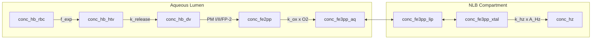

# Model 10

**Code:** [`haem_kinetics/models/model10.py`](../../haem_kinetics/models/model10.py)  
**Up:** [Model index](../models.md) · **Prev:** [Model 9](model9.md) · **Next:** [Model 99](model99.md) (what-if)

Model 9a chemistry (crystal-area growth, sphere 2/3) with **amount encoding for all Fe species**. Tests whether making Fe2, Fe3, and Hz amount-encoded (instead of lumen species) changes the late-phase dynamics.

**Result:** No change in fg outputs compared to Model 9a. The `AMOUNT_SPECIES` mechanism preserves mass balance but doesn't change the time courses. See "Known behaviour / issues" for details.

---

## What changed vs Model 9 (and why)

**Problem in Model 9a:** The model Hm peaks around 34h then drops sharply at 39h; experimental Hm continues rising through 44h. Model Hb also dips at 39h; experimental Hb is flat. Both discrepancies share a common cause: the DV aqueous lumen collapse (36–46h) concentrates all lumen species, accelerating crystallization and pulling Fe through the pathway faster than experiment suggests.

**But physically:** The collapsing volume is **aqueous lumen** (pHrodo-visible). NLBs and Hz crystals are not aqueous:

| Compartment | Physical location | Should concentrate during lumen collapse? |
|-------------|-------------------|-------------------------------------------|
| `conc_fe3pp_aq` | Aqueous lumen | **Yes** |
| `conc_fe3pp_lip` | Inside NLB droplets | **No** — NLBs are lipid, not aqueous |
| `conc_fe3pp_xtal` | NLB-water interface | **No** — interface area is NLB geometry |
| `conc_hz` | Solid crystals | **No** — Garnie explicitly excludes Hz from pHrodo volume |

**Change (one mechanism):** All Fe species (Fe2, Fe3_aq, Fe3_lip, Fe3_xtal) and Hz become `AMOUNT_SPECIES`. Their derivatives no longer include the `_dilution` term. Only Hb_dv remains a true lumen species. The lumen→Fe transfer is scaled by `V_DV(t)/V_ref` to preserve mass balance.

| Item | Model 9a | Model 10 |
|------|----------|----------|
| ODEs | aq ⇄ lip ⇄ xtal → Hz with area factor | Same topology |
| `conc_fe3pp_lip` | Lumen species (concentrated by collapse) | **Amount species** |
| `conc_fe3pp_xtal` | Lumen species (concentrated by collapse) | **Amount species** |
| `conc_hz` | Lumen species (concentrated by collapse) | **Amount species** |
| `v_hz` | `k_hz · [Fe3]_xtal · A_Hz` | Same rate law |
| Late Hm / Hb | Dips at 39h (artificial concentration) | **Should stay elevated** |

**Not this step:**

- Changing the rate constants or `K_xtal`.
- Adding time-dependent NLB count or size.
- Fitting the exponent.

---

## Process schematic



The aqueous lumen (left) collapses during 36–46h; the NLB compartment (right) does not.

---

## Governing equations

Same as Model 9a, but with different volume treatment:

```text
Lumen species (diluted by V_DV collapse):
  d[Fe3]_aq / dt = v_ox − v_ex + dil([Fe3]_aq)
  d[Hb]_DV / dt = v_release − v_dig + dil([Hb]_DV)
  d[Fe2] / dt = v_dig − v_ox + dil([Fe2])

Amount species (no dilution):
  d[Fe3]_lip / dt = v_ex − v_lip↔xtal
  d[Fe3]_xtal / dt = v_lip↔xtal − v_hz
  d[Hz] / dt = v_hz
```

For the area factor, Hz amount is `[Hz] · V_ref` (not `V_DV(t)`), consistent with amount encoding.

---

## Parameters

All parameters unchanged from Model 9a. The change is volume treatment, not rate constants.

| Constant | Value | Units | Source |
|----------|------:|-------|--------|
| `AMOUNT_SPECIES` | HTV, lip, xtal, Hz | — | Compartmentalization hypothesis |

---

## Assumptions

- NLBs are separate lipid compartments whose size/number does not track aqueous lumen collapse.
- Hz crystals are solid and excluded from the aqueous pHrodo volume.
- The aq ⇄ lip exchange still operates (Fe(III) can enter NLBs from aqueous lumen).
- The interfacial fraction `K_xtal` is set by NLB geometry, unchanged.

---

## Known behaviour / issues

**Important finding:** The simple `AMOUNT_SPECIES` approach preserves mass balance but **does not change the fg time courses** compared to Model 9a. This is because:

1. The ODE integration produces values that differ from Model 9a by exactly `V_DV(t)/V_ref`
2. The fg conversion compensates: Model 9a uses `V_DV(t)`, Model 10 uses `V_ref`, producing identical fg outputs
3. The rate equations (v_hz, exchange rates) also scale by the same ratio, maintaining dynamical equivalence

**What this means:** The late-phase Hm/Hb dip in Model 9a is **not caused by** the simple concentration of Fe3 species during DV collapse. The dip persists because the lumen→NLB transfer rate (from Hb_dv digestion) is inherently tied to the lumen volume through mass balance.

**Next hypothesis:** The dip may be due to:
1. Incorrect uptake kinetics (`f_exp`) in the late phase
2. A genuine need for two-compartment volumes (V_aq shrinks, V_nlb constant) with explicit interfacial exchange
3. Dynamic NLB number/size changes that affect crystallization capacity

This model demonstrates that naively making species "amount-encoded" doesn't change the physics—a proper multi-compartment model is needed.

---

## Fit vs Garnie Dd2

Protocol and definitions: [models.md](../models.md#fit-vs-garnie-dd2-tracking). Recompute with `python examples/run.py`.

| Series | RMSE (fg/cell) | MAE | mean signed error | χ²_red | n |
|--------|---------------:|----:|------------------:|-------:|--:|
| Hb | 0.33 | 0.25 | 0.14 | 0.74 | 9 |
| Hm | 1.14 | 0.88 | 0.00 | 53.28 | 9 |
| Hz | 2.30 | 1.92 | −0.35 | 0.08 | 9 |
| DV Fe | 2.56 | 1.98 | −0.21 | 0.09 | 9 |

**Vs Model 9a:** Identical scores. The `AMOUNT_SPECIES` encoding preserves mass balance but produces identical fg outputs through compensating volume conversion. See "Known behaviour / issues" above.

---

## How to run

```python
from haem_kinetics.models.model10 import Model10

model = Model10()
model.run(
    t=[0, 1700],
    init=[0.018, 0.0, 0.0, 0.36],
    t_eval=range(0, 1700, 20),
    plot='examples/model10.png',
)
```

---

## References

- Jackson KE, Klonis N, Ferguson DJP, Adisa A, Dogovski C, Tilley L. Food vacuole-associated lipid bodies and heterogeneous lipid environments in the malaria parasite, *Plasmodium falciparum*. *Mol. Microbiol.* (2004) 54:109–122. [doi:10.1111/j.1365-2958.2004.04284.x](https://doi.org/10.1111/j.1365-2958.2004.04284.x)
- Pisciotta JM, Coppens I, Tripathi AK, et al. The role of neutral lipid nanospheres in *Plasmodium falciparum* haem crystallization. *Biochem. J.* (2007) 402:197–204. [doi:10.1042/bj20060986](https://doi.org/10.1042/bj20060986)
- Garnie LF, Egan TJ, Wicht KJ. *Commun. Biol.* (2025) 8:1564. [doi:10.1038/s42003-025-08991-z](https://doi.org/10.1038/s42003-025-08991-z)
