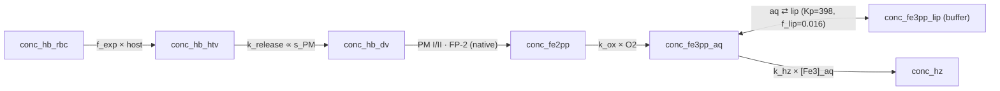

# Model 12 (12a / 12b / 12c)

**Code:** [`model12a.py`](../../haem_kinetics/models/model12a.py) · [`model12b.py`](../../haem_kinetics/models/model12b.py) · [`model12c.py`](../../haem_kinetics/models/model12c.py)  
**Up:** [Model index](../models.md) · **Prev:** [Model 10](model10.md) · **Next:** [Model 13](model13.md)

A hybrid: **Myburgh (2023) Hm/Hz speciation on our HTV Hb machinery.** Myburgh's ODE ladder fits Dd2 free-haem and haemozoin well (R² ≈ 0.87 and 0.99) but never held Hb above ~10⁻⁶ fg because it had no protected Hb pool. Our HTV inner-vesicle cargo (Models 5–6) is exactly that missing pool. Model 12 keeps our Hb subsystem and adopts Myburgh's crystallisation mechanism.

**Result:** **12a is the best combined fit on the ladder** (Hm χ²_red 53.3 → 4.3 vs Model 9a, Hz signed error −0.04 fg, Hb unchanged), using only literature constants already in the repo — **no retuning**.

---

## The one mechanistic change (12a)

Model 7 already implements Myburgh's Model 3 lipid partition (aqueous ⇄ lipid Fe(III), `K_partition = 398`, `f_lip = 0.016`). The **only** difference between our lipid ladder (Models 7–9) and Myburgh's is the crystallisation *substrate*:

| | Crystallisation substrate | Consequence for standing Hm |
|--|---------------------------|------------------------------|
| Model 7 | bulk **lipid** pool (~87 % of free haem) | drains Hm too fast → Hm low (signed −2.88) |
| Model 8/9 | **interfacial** xtal pool (patched with area growth) | Model 8 overshoots (+2.60); Model 9 needs `(n/n₀)^α` |
| **Model 12a** | **aqueous** hematin (~13 %), lipid is a buffer | Myburgh eq. 4.53: slow crystallisation from a small pool keeps Hm high **without** an area-growth term |

Myburgh (§4.4.3.3, eq. 4.53) crystallises from aqueous Fe(III)PPIX only; the NLB lipid is a reservoir (Egan lipid-mediated β-haematin nucleates at the lipid–water interface from dissolved hematin). Because the partition parks ~87 % of free haem in lipid, only the small aqueous fraction is crystal-competent, so first-order `k_hz` on the aqueous pool reproduces both the standing Hm **and** the Hz rise — the crystal-area growth of Model 9 is not needed.

```text
Model 12a Fe(III) (change vs Model 7 in bold):
  d[Fe3]_aq  / dt = v_ox − v_red − v_ex − **v_hz** + dil([Fe3]_aq)
  d[Fe3]_lip / dt = v_ex + dil([Fe3]_lip)          # bulk lipid is a buffer, no sink
  d[Hz]      / dt = **v_hz**,   v_hz = k_hz · [Fe3]_aq
```

Everything else is inherited from Model 7: our `f_exp × host` uptake, HTV inner-vesicle cargo, `k_release(t) ∝ s_PM(t)`, native-competent digestion, and `variable_dv_volume` bookkeeping. Assay Hb = HTV + lumen; assay Hm = Fe(II) + Fe(III)_aq + Fe(III)_lip.

**Not this step:** no new constant is introduced or retuned. `k_hz`, `K_partition`, `f_lip` are the same literature values used since Model 7.

---

## Uptake variants (12a / 12b / 12c)

The three variants share 12a's Fe speciation and differ **only** in how Hb enters the DV, to test whether the residual late-phase Hm dip is a host-depletion artifact.

| | Hb uptake | Host `[Hb_RBC]` | DV volume | Digestion / `[E]` | HTV release |
|--|-----------|-----------------|-----------|-------------------|-------------|
| **12a** | our `f_exp × remaining host` (Model 2b) | **finite, depletes** (conserving) | variable (Garnie) | native, `s_PM(t)` | `∝ s_PM(t)` |
| **12b** | Myburgh empirical `A·B·exp(B·t)` | **finite, depletes** (conserving, ours) | variable (Garnie) | native, `s_PM(t)` | `∝ s_PM(t)` |
| **12c** | Myburgh empirical (as 12b) | **constant** (Myburgh BC) | **constant 1 fL** | **6-parallel peptide MM, constant `[E]`** | **constant** |

Myburgh's uptake (Table 4.5): total DV heme-Fe `T(t) = A·exp(B·t)` with `A = 13.1` fg, `B = 8.3×10⁻⁴` min⁻¹ (t from invasion). Since Hb is the only Fe source, `v_up = dT/dt = A·B·exp(B·t)`, converted to mol/min via `M_Fe = 55.845` and to M/min on the lumen. Its *magnitude* is independent of the remaining host (unlike `f_exp × host`).

**Host boundary condition — the key contrast between 12b and 12c.**

- **12b keeps our conserving ladder:** the finite host is drawn down by uptake and uptake stops when it is spent. Because Myburgh's exponential is calibrated to deliver more Fe than our ~85 fg host holds, the host is exhausted near **43.5 h** and assay Hb/Hm fall sharply afterwards. **This late cliff is not a bug** — it is the honest consequence of combining Myburgh's over-delivering uptake with mass conservation, and it shows his empirical law is inconsistent with a conserved 106 fg budget.
- **12c uses Myburgh's own boundary condition:** `[Hb_RBC]` held *constant* — "any decrease in Hb in the RBC due to uptake is compensated for by the decrease in RBC cytoplasm volume" (§4.4.1.1), an infinite RBC reservoir. The exponential is never truncated, so Hb/Hm/Hz rise smoothly through 44 h with **no cliff** — matching Myburgh. **Consequence: host+DV Fe is not conserved** (model total → ~194 fg); only the DV total is the experimental target. This is a deliberate departure from the conserving ladder, isolated to the faithful-replication variant.

12c is otherwise a fuller replication of Myburgh's working configuration (constant 1 fL — his Models 1–3; six proteases in parallel with constant enzyme concentration on the Banerjee/Luker/Ramjee peptide MM table — his Table 4.3; no `s_PM`), with our HTV cargo (constant first-order release) as the **only** retained element so assay Hb is non-negligible.

---

## Process schematic (12a)



Crystallisation draws only from the small aqueous pool; the lipid reservoir keeps assayable free haem high.

---

## Parameters

No new or retuned constants. 12a/12b use only the shared literature values.

| Constant | Value | Units | Source |
|----------|------:|-------|--------|
| `k_hz` | 0.12 | min⁻¹ | Median β-haematin rate (Ambele/Egan; Gildenhuys) — Myburgh's kHZ |
| `K_partition` | 398 | — | Fe(III)PPIX logP 2.6 (Hoang) — Myburgh's Kp |
| `f_lip` | 0.016 | — | Pisciotta lipid:heme → Gligorijevic V_DV — Myburgh's Vf |
| 12b/12c uptake `A` | 13.1 | fg | Myburgh Table 4.5 (exp. fit to total DV heme-Fe) |
| 12b/12c uptake `B` | 8.3×10⁻⁴ | min⁻¹ | Myburgh Table 4.5 |

---

## Fit vs Garnie Dd2

Protocol and definitions: [models.md](../models.md#fit-vs-garnie-dd2-tracking). Recompute with `python examples/run.py`.

**Model 12a** (mean signed error: Hb +0.14, Hm −0.31, Hz −0.04, DV Fe −0.21):

| Series | RMSE (fg/cell) | MAE | mean signed error | χ²_red | n |
|--------|---------------:|----:|------------------:|-------:|--:|
| Hb | 0.33 | 0.25 | 0.14 | 0.74 | 9 |
| Hm | 0.93 | 0.68 | −0.31 | 4.29 | 9 |
| Hz | 2.18 | 1.81 | −0.04 | 0.10 | 9 |
| DV Fe | 2.56 | 1.98 | −0.21 | 0.09 | 9 |

**Model 12b** — conserving; host exhausts at ~43.5 h → late cliff (mean signed: Hb +0.30, Hm −0.11, Hz +4.96, DV Fe +5.16):

| Series | RMSE | MAE | signed | χ²_red | n |
|--------|-----:|----:|-------:|-------:|--:|
| Hb | 0.73 | 0.59 | 0.30 | 4.95 | 9 |
| Hm | 0.72 | 0.57 | −0.11 | 3.41 | 9 |
| Hz | 5.76 | 4.96 | 4.96 | 0.87 | 9 |
| DV Fe | 6.16 | 5.16 | 5.16 | 1.13 | 9 |

**Model 12c** — full Myburgh, constant `[Hb_RBC]`, monotonic (mean signed: Hb −0.25, Hm −0.02, Hz +5.79, DV Fe +5.52):

| Series | RMSE | MAE | signed | χ²_red | n |
|--------|-----:|----:|-------:|-------:|--:|
| Hb | 0.50 | 0.42 | −0.25 | 2.01 | 9 |
| Hm | 0.49 | 0.40 | −0.02 | 6.19 | 9 |
| Hz | 6.41 | 5.79 | 5.79 | 1.15 | 9 |
| DV Fe | 6.29 | 5.52 | 5.52 | 1.13 | 9 |

(12b conserves total Fe at 106 fg. 12c's DV Fe is DV-only; its host is held constant, so total model Fe reaches ~194 fg — see the host boundary-condition note above.)

---

## Known behaviour / findings

1. **12a is the best combined fit.** Moving crystallisation to the aqueous pool cuts Hm χ²_red from 53.3 (Model 9a) to 4.3 and makes Hz signed error near-zero (−0.04 fg), with Hb unchanged and total Fe conserved at 106 fg — using constants already in the repo. This validates the hypothesis that Myburgh's Hm/Hz mechanism + our HTV Hb mechanism is the right combination.

2. **12a's residual late dip is uptake-driven, not the Hm/Hz mechanism.** Fine-grained trajectories show 12a's HTV peaks at 38 h (2.74 fg) then declines to 1.5 fg at 44 h, and Fe(III)_aq peaks at 40 h then falls — all because our `f_exp × host` uptake *tapers* as the host depletes (43 → 5 fg). The host never reaches 0; the taper alone starves HTV replenishment and drains free haem while crystallisation continues. The dip is a property of the `f_exp × host` law, which leaves ~5 fg unconsumed at 44 h whereas experiment consumes almost all host Hb.

3. **12b's late cliff is the honest cost of conservation; 12c is monotonic under Myburgh's own boundary condition.** 12b keeps the conserving ladder, so drawing Myburgh's over-delivering exponential from the finite ~85 fg host exhausts it at ~43.5 h and assay Hb/Hm fall sharply — a genuine signal that his empirical law is inconsistent with a conserved 106 fg budget. 12c instead adopts Myburgh's constant-`[Hb_RBC]` reservoir (§4.4.1.1): the exponential is never truncated, so Hb/Hm/Hz rise smoothly through 44 h with **no cliff**, matching him. The price of 12c's boundary condition is that host+DV Fe is not conserved (total → ~194 fg) and Hz overshoots ~5 fg because his exponential runs hot vs the Garnie Dd2 total. The 12b↔12c pair therefore isolates exactly what Myburgh's infinite-reservoir assumption buys (a monotonic profile) and costs (non-conservation + Hz overshoot).

**Interpretation:** Myburgh's clean, monotonic Hm/Hz fit relies on an infinite RBC reservoir (constant `[Hb_RBC]`). On that same boundary condition, our HTV pool turns his unfittable Hb (~10⁻⁶ fg) into a good assay Hb (12c Hb χ²_red 2.0) — confirming the HTV cargo is the missing piece. Two distinct questions remain: (i) 12a shows that a *conserving* uptake law (`f_exp × host`) tapers too early, and (ii) 12b shows that Myburgh's *empirical* uptake over-delivers, exhausting a conserved host. The cliff in particular is decoupled from the standing pools: **[Model 13](model13.md)** shows 12b's 44 h drop is *host exhaustion* (Myburgh's exponential drains the mean-cell budget to zero), and that scoring an average-106-fg cell against data whose DV inventory already equals that whole budget is the real error. Using the upper MCHC reference bound (~112 fg) lets the host survive and removes the cliff with one cited parameter — no delivery reshaping.

---

## How to run

```python
from haem_kinetics.models.model12a import Model12a  # or Model12b / Model12c

model = Model12a()
model.run(
    t=[0, 1700],
    init=[0.018, 0.0, 0.0, 0.36],
    t_eval=range(0, 1700, 20),
    plot='examples/model12a.png',
)
```

---

## References

- Myburgh KDV. *Computational and experimental studies of haemoglobin degradation and haemozoin formation in* Plasmodium falciparum. PhD thesis, University of Cape Town (2023), Chapter 4 (Models 1–4). Rate laws: eq. 4.53 (aqueous crystallisation), Table 4.3 (proteases), Table 4.5 (empirical uptake). Extract: [`docs/KDV_2023_Myburgh_model-extract.pdf`](../KDV_2023_Myburgh_model-extract.pdf).
- Egan TJ, Chen JY, de Villiers KA, et al. Haemozoin (β-haematin) biomineralization requires both a lipid medium and an accelerating structure. *Malar. J.* (2012) 11:337. [doi:10.1186/1475-2875-11-337](https://doi.org/10.1186/1475-2875-11-337)
- Hoang AN, Ncokazi KK, de Villiers KA, et al. Interaction of Fe(III)PPIX with lipids; logP for neutral Fe(III)PPIX. (partition coefficient source for `K_partition`).
- Pisciotta JM, Coppens I, Tripathi AK, et al. Neutral lipid nanospheres in *P. falciparum* haem crystallization. *Biochem. J.* (2007) 402:197–204. [doi:10.1042/bj20060986](https://doi.org/10.1042/bj20060986)
- Garnie LF, Egan TJ, Wicht KJ. *Commun. Biol.* (2025) 8:1564. [doi:10.1038/s42003-025-08991-z](https://doi.org/10.1038/s42003-025-08991-z)
