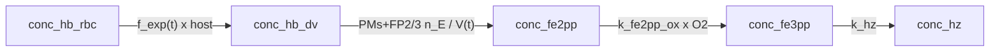

# Model 2a / 2b

**Code:** [`haem_kinetics/models/model2.py`](../../haem_kinetics/models/model2.py), [`model2b.py`](../../haem_kinetics/models/model2b.py)  
**Up:** [Model index](../models.md) · **Prev:** [Model 1](model1.md) · **Next:** [Model 3](model3.md)

Model 1 plus **accelerating host→DV uptake**. Both encodings are first-order in leftover host Hb. Protease **amount** stays at PaxDB `n_E`. No lipid chemistry. Simulation time `t` is minutes from 16 h, as in every other model.

**Model 2a** is the one-phase comparison. **Model 2b** is the ladder default (Models 3–10 inherit it): the same law with a faster late phase after Garnie Fig. 5B’s 29 h break.

---

## What changed vs Model 1 (and why)

**Problem in Model 1:** linear `k_hb_trans · [Hb]_RBC` delivers too little Fe (~84 fg still in host; Hz stuck near the ~20 fg seed).

**Change:** replace linear uptake with `f_exp(t) · [Hb]_RBC`. Mole rate = `f(t) · n_host`. `a` and `b` are empirical (Dd2 defaults).

| Item | Model 1 | Model 2a | Model 2b |
|------|---------|----------|----------|
| Uptake | `k_hb_trans · [Hb]_RBC` | one `f_exp(t)` × remaining host | two-phase `f_exp` × remaining host |
| Break | — | — | Garnie Fig. 5B **29 h** (`t` = 780 min), not fitted; `f_exp` **continuous** at the join |
| Enzyme amount | PaxDB `n_E` | Unchanged | Unchanged |
| Fe³⁺ / Hz | `k_hz · [Fe3]` | Unchanged | Unchanged |

**Not this step:** cytostome kinetics, pHrodo Fig. 2C, `V_DV(t)` (shared bookkeeping), Garnie Fig. 5B as a fg/h `v_up` (that would drop the `× n_host` factor).

---

## Process schematic



---

## Governing equations

Shared chemistry (Model 1 proteases, oxidation, `k_hz`). Uptake only:

```text
# Model 2a — one phase (t in minutes from 16 h)
f_exp(t) = a · b · exp(b · t)     a = 0.1578,  b = 0.001102

# Model 2b — two phases; break from Garnie Fig. 5B (29 h), not fitted.
# f_exp is continuous at t = 780 min (a_l from that join, not a free parameter).
f_exp(t) = a_e · b_e · exp(b_e · t)     t < 780 min
         = a_l · b_l · exp(b_l · t)     t ≥ 780 min
a_e = 0.3224,   b_e = 0.0007607 min⁻¹
b_l = 0.003342 min⁻¹
a_l = a_e · (b_e / b_l) · exp((b_e − b_l) · 780)  = 0.009799

v_up = f_exp(t) · [Hb]_RBC · V_RBC / V_DV(t)
```

2b’s `a_e`, `b_e`, `b_l` were least-squares fit to Dd2 DV Fe (nine ages), with the break held at 29 h and `a_l` fixed by continuity of `f_exp` at the join. Same clock `t` as Model 2a. Still × leftover host; host = 0 still stops uptake.

ODEs otherwise identical to Model 1 / Model 2a (`v_dig`, `v_ox`, `v_hz`, dilution).

---

## Parameters (uptake)

| Constant | Model 2a | Model 2b | Units | Description |
|----------|---------:|---------:|-------|-------------|
| `a` / `a_e` | 0.1578 | 0.3224 | — | Early (or only) prefactor |
| `b` / `b_e` | 0.001102 | 0.0007607 | min⁻¹ | Early (or only) exponential rate |
| `a_l` | — | 0.009799 | — | Late prefactor (from continuity at 29 h) |
| `b_l` | — | 0.003342 | min⁻¹ | Late exponential rate |
| `t_break` | — | 780 | min | Fig. 5B 29 h − 16 h |
| `k_hz` | 0.12 | 0.12 | min⁻¹ | Unchanged |

Shared volumes, PaxDB ppm, peptide `kcat`/`Km`: [models.md](../models.md).

---

## Fit vs Garnie Dd2

Protocol: [models.md](../models.md#fit-vs-garnie-dd2-tracking). Both scored the same way (ODE vs Dd2 ages 20–44 h, `n` = 9).

**Model 2a**

| Series | RMSE (fg/cell) | MAE | mean signed error | χ²_red | n |
|--------|---------------:|----:|-----:|-------:|--:|
| Hb | 1.91 | 1.87 | −1.87 | 37.13 | 9 |
| Hm | 3.38 | 3.11 | −3.11 | 231 | 9 |
| Hz | 11.63 | 7.66 | −6.12 | 0.57 | 9 |
| DV Fe | 15.89 | 11.11 | −11.11 | 1.17 | 9 |

**Model 2b**

| Series | RMSE (fg/cell) | MAE | mean signed error | χ²_red | n |
|--------|---------------:|----:|-----:|-------:|--:|
| Hb | 1.91 | 1.87 | −1.87 | 37.13 | 9 |
| Hm | 3.21 | 2.95 | −2.95 | 215 | 9 |
| Hz | 5.32 | 4.62 | +4.62 | 0.48 | 9 |
| DV Fe | 2.56 | 1.98 | −0.21 | 0.09 | 9 |

**Vs Model 1 / 2a:** Model 2a already improved Hz (37.66 → 11.63) and DV Fe (42.76 → 15.89, R² = 0.612) but leaves ~36 fg in the host at 44 h. Model 2b’s faster late specific rate improves inventory (DV Fe RMSE 15.89 → 2.56, R² = 0.990; host ~5 fg at 44 h) and Hz RMSE 11.63 → 5.32. Hz signed error flips positive: Model 1 chemistry dumps the extra delivered Fe into Hz. Hb still collapsed. The last assay point (44 h, ~105 fg) is still a little low (~101 fg): first-order remaining host still damps the final gulp.

2b **is** inherited by Models 3–10. 2a remains available as the one-phase comparison.

---

## How to run

```python
from haem_kinetics.models.model2 import Model2a
from haem_kinetics.models.model2b import Model2b

kwargs = dict(t=[0, 1700], init=[0.018, 0.0, 0.0, 0.36], t_eval=range(0, 1700, 20))
Model2a().run(**kwargs, plot='examples/model2a.png')
Model2b().run(**kwargs, plot='examples/model2b.png')
```
