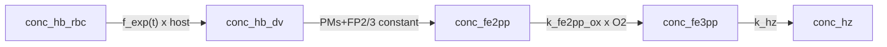

# Model 2

**Code:** [`haem_kinetics/models/model2.py`](../../haem_kinetics/models/model2.py)  
**Up:** [Model index](../models.md) · **Prev:** [Model 1](model1.md)

Model 1 plus **accelerating host→DV uptake** via fractional exponential growth of remaining host Hb. Protease levels stay at constant PaxDB `[E]`. No lipid chemistry.

---

## What changed vs Model 1 (and why)

**Problem in Model 1:** linear `k_hb_trans · [Hb]_RBC` delivers too little Fe over the trophozoite window (~84 fg still in host; Hz stuck near the ~20 fg seed). DV intermediates stay near zero because whatever arrives is digested immediately — the dominant Fe shortfall is **uptake**, not crystallization.

**Change (one mechanism):** replace linear uptake with

```text
f_exp(t) = a · b · exp(b · t)     a = 0.1578,  b = 0.001102
v_up = f_exp(t) · [Hb]_RBC · V_RBC / V_DV
```

| Item | Model 1 | Model 2 |
|------|---------|---------|
| Uptake | `k_hb_trans · [Hb]_RBC` | `f_exp(t)` fractional remaining host |
| Effective `[E]` | Constant PaxDB | **Unchanged** (constant) |
| Fe³⁺ / Hz | `k_hz · [Fe3]` | Unchanged |

### Provenance of `a`, `b` (empirical — not a cytostome assay)

`f_exp` was obtained by taking **cumulative Fe already inside the DV / parasite** (model or assay pools such as `Hb_DV + Fe3 + Hz`, which on Dd2 is dominated by Hz) over the trophozoite window and fitting an exponential; `a` and `b` are those fit coefficients. That schedule is a convenient way to **deliver enough Fe** into the DV so downstream speciation can be studied.

It is **not**:

- a measured cytostomal / HCCU rate law;
- digestive-vacuole volume growth `V_DV(t)` (Garnie Dd2 lumen peaks ~3.7 fL with Gompertz growth then collapse);
- equivalent to Elliott’s ring-stage “Big Gulp” (a single early FV-biogenesis event). A lasting `Hb_DV` spike is not expected in the trophozoite fractionation window: standing Hb stays ~1–2 fg while cumulative Fe appears as Hz.

Fixed `V_DV = 1 fL` bookkeeping is unchanged. A later model can introduce Garnie-style dynamic `V_DV(t)` for molar bookkeeping without replacing `f_exp` by assay `dF/dt`.

**Deferred on purpose:** co-scaling enzymes with `f_exp` (old legacy Model 3) mixes two mechanisms; full PaxDB `[E]` already over-digests DV Hb in Model 1.

---

## Process schematic



---

## State variables

| Symbol | Meaning |
|--------|---------|
| `conc_hb_dv` | DV haemoglobin (haem-eq, M) |
| `conc_fe2pp` | Fe(II)PPIX |
| `conc_fe3pp` | Fe(III)PPIX (single pool) |
| `conc_hz` | Haemozoin |
| `conc_hb_rbc` | Remaining host Hb (appended by `run()`) |

Init API: `[Hb_DV, Fe2, Fe3, Hz]`.

---

## Governing equations

```text
# Fractional exponential growth (uptake only; t in minutes from 16 h)
f_exp(t) = a · b · exp(b · t)     a = 0.1578,  b = 0.001102

# Host → DV Hb uptake (M/min on V_DV)
v_up = f_exp(t) · [Hb]_RBC · V_RBC / V_DV

# Effective protease concentration (constant PaxDB [E]; PMs + falcipains)
[E]_i,eff = [E]_i
i ∈ {plm_1, plm_2, hap, plm_4, fp_2, fp_3}

# Haem release from Hb (MM sum; 4 haem-eq per tetramer)
v_dig = 4 · Σ_i  (60 · kcat_i) · [E]_i,eff · [Hb]_tet
                     / (Km_i + [Hb]_tet)

# Fe(II) → Fe(III) oxidation
v_ox  = k_fe2_ox · [Fe(II)] · [O2]

# Fe(III) → Fe(II) reduction (off: [O2−] = 0)
v_red = k_fe3_red · [Fe(III)] · [O2−]

# Haemozoin formation
v_hz  = k_hz · [Fe(III)]
```

ODEs:

```text
d[Hb]_DV / dt   = v_up − v_dig
d[Fe(II)] / dt  = v_dig + v_red − v_ox
d[Fe(III)] / dt = v_ox − v_red − v_hz
d[Hz] / dt      = v_hz
d[Hb]_RBC / dt  = − v_up · V_DV / V_RBC
```

---

## Parameters (Model 2–specific)

| Constant | Value | Units | Description |
|----------|------:|-------|-------------|
| `a` | 0.1578 | — | Prefactor in `f_exp` |
| `b` | 0.001102 | min⁻¹ | Exponential rate in `f_exp` |
| `k_hz` | 0.12 | min⁻¹ | First-order Hz from Fe(III) (same as Model 1) |

Shared volumes, PaxDB ppm, and peptide `kcat`/`Km`: [models.md](../models.md) and [enzyme_kinetics.md](../enzyme_kinetics.md).

---

## Assumptions

- Accelerating fractional uptake of remaining host Hb; fixed `V_DV`.
- Haem-releasing proteases at full PaxDB strength from `t` = 0 (same as Model 1).
- Single Fe(III) pool crystallizing at literature `k_hz`.

---

## Known behaviour / issues

- Faster uptake should move more Fe into Hz / DV pools vs Model 1; DV Hb may still collapse if protease capacity ≫ delivery.
- No basal free-haem mechanism yet (φ / lipid / xtal deferred).
- `a`, `b` come from an empirical exponential fit to cumulative DV Fe, not from a primary uptake assay — see provenance above.

---

## How to run

```python
from haem_kinetics.models.model2 import Model2

model = Model2()
model.run(
    t=[0, 1700],
    init=[0.018, 0.0, 0.0, 0.36],
    t_eval=range(0, 1700, 20),
    plot='examples/model2.png',
)
```
