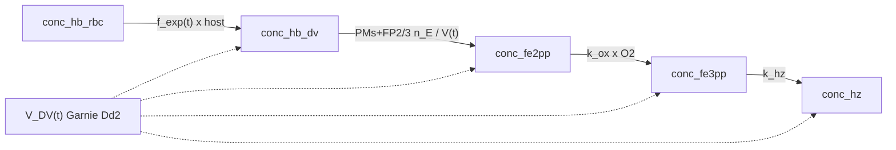

# Model 3

**Code:** [`haem_kinetics/models/model3.py`](../../haem_kinetics/models/model3.py)  
**Up:** [Model index](../models.md) · **Prev:** [Model 2](model2.md)

Model 2’s speciation, `f_exp` uptake, and constant PaxDB **enzyme amount**, but **DV volume follows Garnie Dd2 `V_DV(t)`** for molar bookkeeping.

---

## What changed vs Model 2 (and why)

**Problem in Model 2:** all DV concentrations and `[E]` use a fixed `V_DV = 1 fL`. Garnie, Egan & Wicht (*Commun. Biol.* 2025) measure the Dd2 **aqueous lumen** (Hz excluded): Gompertz growth to ~3.7 fL near 32 h, then linear collapse toward 0 at 46 h.

**Change (one mechanism):** replace the fixed reference volume with that published `V_DV(t)`.

| Item | Model 2 | Model 3 |
|------|---------|---------|
| Uptake | empirical `f_exp` | **Unchanged** (mole delivery independent of `V`) |
| `V_DV` | 1 fL | Garnie Dd2 lumen `V_DV(t)` |
| Enzyme amount | PaxDB `n_E` | **Unchanged** (`[E](t) = n_E / V_DV(t)`) |
| Fe³⁺ / Hz | `k_hz · [Fe3]` | Unchanged (plus dilution of concentrations) |

**Not changed, on purpose:**

- Uptake is **not** `C·dV/dt` (filling the lumen once cannot deliver the Fe budget).
- Uptake is **not** `d(Hb+Hm+Hz)/dt` of the fractionation target (circular).

Host depletion stays `d[Hb]_RBC/dt = − f_exp(t)·[Hb]_RBC`. Instantaneous DV appearance in moles is therefore the same schedule as Model 2; only the volume used to write that flux as a molarity changes.

---

## Process schematic



---

## State variables

Same as Model 2: `[Hb_DV, Fe2, Fe3, Hz]` (+ host), integrated in **M at the current `V_DV(t)`**.

Init API is unchanged (`[Hb_DV, Fe2, Fe3, Hz]` as in Model 2). Those numbers are treated as **1 fL-reference molarities** so the **fg seed is the same** as Model 2; they are rescaled to true M at `V_DV(t=0)` before integration.

---

## Governing equations

```text
# Garnie Dd2 lumen (fL); age in hours post-invasion
# Growth (age ≤ 32 h): Gompertz
V(age) = A · exp(−exp(−k · (age − t_i)))     A = 3.7 fL

# 32–36 h: linear join between Gompertz(32) and the collapse line at 36 h
# Collapse (age ≥ 36 h): linear to (46 h, 0)

# Enzyme amount from PaxDB (independent of V); molarity uses V(t)
[E]_i(t) = ppm_i · 10⁻⁶ · N_prot / (N_A · V_DV(t))

# Host → DV uptake (M/min on V_DV(t); same mole rate as Model 2)
v_up = f_exp(t) · [Hb]_RBC · V_RBC / V_DV(t)

v_dig = 4 · Σ_i  (60 · kcat_i) · [E]_i(t) · [Hb]_tet / (Km_i + [Hb]_tet)
v_ox  = k_fe2_ox · [Fe(II)] · [O2]
v_red = k_fe3_red · [Fe(III)] · [O2−]     # off: [O2−] = 0
v_hz  = k_hz · [Fe(III)]

# Dilution / concentration from dV/dt (chain rule for C = n/V)
dil(C) = − C · (dV_DV/dt) / V_DV
```

ODEs:

```text
d[Hb]_DV / dt   = v_up − v_dig + dil([Hb]_DV)
d[Fe(II)] / dt  = v_dig + v_red − v_ox + dil([Fe(II)])
d[Fe(III)] / dt = v_ox − v_red − v_hz + dil([Fe(III)])
d[Hz] / dt      = v_hz + dil([Hz])
d[Hb]_RBC / dt  = − v_up · V_DV(t) / V_RBC
```

The dilution term is geometry, not extra chemistry: moles `n = C·V` change only by the stated rates. Plotting still uses fg Fe/cell (`C·V_DV(t)`).

---

## Parameters (Model 3–specific)

`V_DV(t)` is `garnie_dd2_vol_dv_L` in [`helpers.py`](../../haem_kinetics/models/helpers.py).

| Constant | Value | Units | Description |
|----------|------:|-------|-------------|
| `A` | 3.7 | fL | Gompertz asymptote; Garnie Dd2 lumen peak ~32 h |
| `k` | 0.3138 | h⁻¹ | Gompertz rate; LS to xlsx means at 20, 24, 32 h |
| `t_i` | 21.69 | h | Gompertz inflection; same reconstruction |
| Collapse slope | 0.0763 | fL h⁻¹ | Linear through 36 h & 40 h means, constrained to (46 h, 0) |
| `a`, `b` | 0.1578, 0.001102 | —, min⁻¹ | Model 2 `f_exp` (unchanged) |
| `k_hz` | 0.12 | min⁻¹ | Same as Model 2 |

Shared PaxDB ppm / peptide `kcat`/`Km`: [models.md](../models.md), [enzyme_kinetics.md](../enzyme_kinetics.md). Source volumes: [`data/garnie/phrodo_Dd2.xlsx`](../../data/garnie/phrodo_Dd2.xlsx).

---

## Assumptions

- Lumen volume is Garnie’s **aqueous** DV (Hz crystals excluded). Hz is still converted with `V_DV(t)` so `C·V` tracks amount.
- Enzyme **count** is the Tao 2014 PaxDB whole-organism number, all assigned to the DV; molarity falls as the lumen grows.
- `f_exp` remains the Fe-delivery placeholder; volume is not an uptake mechanism.
- Model is defined only while `V_DV > 0` (collapse reaches 0 at 46 h).

---

## Known behaviour / issues

- **fg time courses can look close to Model 2.** For first-order rates `v = k·C`, `dn/dt = k·n` is independent of `V`. Saturated MM digestion likewise depends on enzyme **amount**, which is the same as Model 2. Volume mainly rescales molarities and the unsaturated-MM `[S]` term.
- `V(16 h)` from the Gompertz origin extrapolation is ~0.01 fL (first measurement is 20 h). Seed fg is preserved, so initial M is large.
- DV Hb may still collapse (enzyme capacity ≫ delivery).
- Lumen collapse concentrates remaining soluble species if moles stay in the DV; Garnie notes the fate of lumen contents is unknown — this model does not add an export term.

---

## How to run

```python
from haem_kinetics.models.model3 import Model3

model = Model3()
model.run(
    t=[0, 1700],
    init=[0.018, 0.0, 0.0, 0.36],
    t_eval=range(0, 1700, 20),
    plot='examples/model3.png',
)
```

---

## References

- Garnie LF, Egan TJ, Wicht KJ. Heme processing in the malaria parasite, *Plasmodium falciparum*: a time-dependent basal-level analysis. *Commun. Biol.* (2025) 8:1564. [doi:10.1038/s42003-025-08991-z](https://doi.org/10.1038/s42003-025-08991-z) · [Nature](https://www.nature.com/articles/s42003-025-08991-z) · [PDF](https://www.nature.com/articles/s42003-025-08991-z.pdf) · [Figshare](https://doi.org/10.6084/m9.figshare.28801805)
