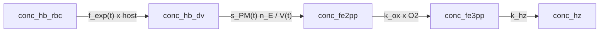

# Model 3

**Code:** [`haem_kinetics/models/model3.py`](../../haem_kinetics/models/model3.py)  
**Up:** [Model index](../models.md) · **Prev:** [Model 2](model2.md) · **Next:** [Model 4](model4.md)

Model 2 chemistry (`f_exp` uptake, shared `variable_dv_volume` bookkeeping) plus a **plasmepsin amount schedule** `s_PM(t)` reconstructed from Garnie Fig. 3 immunoblots.

---

## What changed vs Model 2 (and why)

**Problem in Model 2:** PaxDB sets a constant enzyme **amount** from `t` = 0, so DV Hb collapses as soon as it arrives (~0 vs assay ~1–2 fg). Standing DV Hb is the first broken step after uptake. Hz / internalized Fe are already the least-wrong series.

**Change (one mechanism):** scale that PaxDB amount by the published PM I/IV time course.

```text
s_PM(age)  = relative PM amount from Garnie Fig. 3; plateau (40–44 h) = 1
             16–20 h: hold at the first measured (20 h) point
[E]_i,eff  = s_PM(age) · n_E,i / V_DV(t)
```

| Item | Model 2 | Model 3 |
|------|---------|---------|
| Uptake | empirical `f_exp` | **Unchanged** |
| `V_DV(t)` | `variable_dv_volume` | **Unchanged** (not this step) |
| Enzyme amount | PaxDB `n_E` | `s_PM(t) · n_E` |
| Fe³⁺ / Hz | `k_hz · [Fe3]` | Unchanged |

**Not this step:**

- An uncited logistic (`t_mid = 26 h`) — it is not from a paper and contradicts Fig. 3 (PMs already present at 20 h).
- Peptide→native-Hb `kcat` rescale.
- Lipid / crystal-competent Fe3 (basal Hm).
- Making volume “the Model 3 idea” — `variable_dv_volume` is shared from Model 1.
- Garnie Dd2 digestion rates 0.9 then 4.8 fg/h as `v_dig` (same Fe inventory used as the scoring target).

---

## Process schematic



---

## State variables

Same as Model 2: `[Hb_DV, Fe2, Fe3, Hz]` (+ host), integrated in **M at the current `V_DV(t)`**. Init numbers are 1 fL-reference molarities (fg seed unchanged).

---

## Governing equations

Shared `V_DV(t)`, dilution, and `f_exp` uptake: [models.md](../models.md#shared-framework). The Model 3 addition is `s_PM`:

```text
# Relative PM amount (mean of PM I and PM IV blot %; plateau 40–44 h = 1)
s_PM(age) = piecewise-linear through Garnie Fig. 3 ages
            (hold 16–20 h at the 20 h knot; hold after 44 h at the 44 h knot)

[E]_i,eff = s_PM(age) · n_E,i / V_DV(t)
i ∈ {plm_1, plm_2, hap, plm_4, fp_2, fp_3}

v_dig = 4 · Σ_i  (60 · kcat_i) · [E]_i,eff · [Hb]_tet / (Km_i + [Hb]_tet)
```

ODEs are otherwise Model 2 (including dilution).

---

## Parameters (Model 3–specific)

`s_PM` is `garnie_pm_amount_scale` in [`helpers.py`](../../haem_kinetics/models/helpers.py). Source: Garnie Fig. 3 (NF54, per 50k parasites) / Figshare *PM I and PM IV raw data_enzyme analysis.xlsx*, sheet column **Average of Percent values** (mean blot % of total PM signal — amount, not vs BiP). At 24 h the spreadsheet dropped one outlier (PM I: NF2; PM IV: NF1). Immunoblot ≠ the Dd2 Hb/Hm/Hz scoring target.

The same `s_PM` is applied to all haem-releasing proteases. Only PM I and IV were measured — an explicit approximation for PM II, HAP, and falcipains.

| Age (h) | PM I % | PM IV % | Mean % | `s_PM` |
|--------:|-------:|--------:|-------:|-------:|
| 20 | 9.74 | 7.28 | 8.51 | 0.405 |
| 24 | 7.80 | 5.29 | 6.54 | 0.312 |
| 28 | 11.16 | 10.05 | 10.60 | 0.505 |
| 32 | 16.21 | 14.97 | 15.59 | 0.743 |
| 36 | 17.22 | 19.48 | 18.35 | 0.874 |
| 40 | 19.63 | 22.20 | 20.91 | 0.996 |
| 44 | 19.35 | 22.77 | 21.06 | 1.004 |

`s_PM` is mean % divided by the 40–44 h plateau (mean of those two ages). PaxDB still sets plateau **amount**; `s_PM` only shapes time; `V_DV(t)` converts to molarity.

Fig. 3 text (for orientation, not a substitute for the table): 20–28 h lag; 28–32 h increase; 32–44 h gradual rise; plateau 40–44 h.

---

## Assumptions

- NF54 blot time course is used as the relative amount clock on Dd2 models (Garnie Fig. 3 is NF54).
- Relative OD traces **amount** per 50k parasites, not lumen concentration (volume is already in `V_DV(t)`).
- `f_exp` remains the Fe-delivery placeholder.

---

## Known behaviour / issues

- **Lag `s_PM(20 h) ≈ 0.41` of plateau.** That is already a large fraction of full PaxDB amount. DV Hb still collapses (~0 vs assay ~1–2 fg); fg scores match Model 2. [Model 4](model4.md) is the next accountable step (peptide vs native-Hb substrate), not a steeper invented delay.
- Hm remains drained by `k_hz · [Fe3]` — that is a later lipid/xtal step, not a reason to add a haem-parking term here.
- Model is defined only while `V_DV > 0` (collapse reaches 0 at 46 h).

---

## Fit vs Garnie Dd2

Protocol and definitions: [models.md](../models.md#fit-vs-garnie-dd2-tracking).

| Series | RMSE (fg/cell) | MAE | mean signed error | χ²_red | n |
|--------|---------------:|----:|-----:|-------:|--:|
| Hb | 1.91 | 1.87 | −1.87 | 37.13 | 9 |
| Hm | 3.38 | 3.11 | −3.11 | 231 | 9 |
| Hz | 11.63 | 7.66 | −6.12 | 0.57 | 9 |
| DV Fe | 15.89 | 11.11 | −11.11 | 1.17 | 9 |

**Vs Model 2:** identical fg scores. The blot-derived clock is in the ODEs; it does not leave a standing DV Hb pool because early `s_PM` is already ~40% of the PaxDB plateau. Success for this step is the accountable enzyme clock, not a still-bad Hm score used to justify a haem-parking term.

---

## How to run

```python
from haem_kinetics.models.model3 import Model3

model = Model3()
model.run(
    t=[0, 1700],
    init=[0.018, 0.0, 0.0, 0.36],
    t_eval=range(0, 1700, 20),
    plot='examples/model3.png',
)
```

---

## References

- Garnie LF, Egan TJ, Wicht KJ. Heme processing in the malaria parasite, *Plasmodium falciparum*: a time-dependent basal-level analysis. *Commun. Biol.* (2025) 8:1564. [doi:10.1038/s42003-025-08991-z](https://doi.org/10.1038/s42003-025-08991-z) · [Nature](https://www.nature.com/articles/s42003-025-08991-z) · [PDF](https://www.nature.com/articles/s42003-025-08991-z.pdf) · [Figshare](https://doi.org/10.6084/m9.figshare.28801805) (file: *PM I and PM IV raw data_enzyme analysis.xlsx*)
