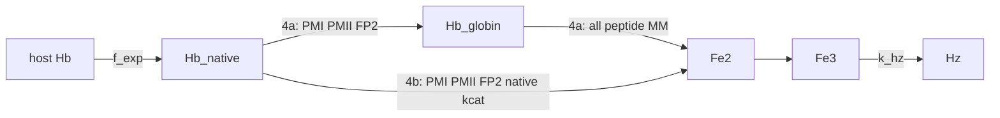

# Model 4a / 4b

**Code:** [`haem_kinetics/models/model4a.py`](../../haem_kinetics/models/model4a.py), [`model4b.py`](../../haem_kinetics/models/model4b.py), shared [`native_hb.py`](../../haem_kinetics/models/native_hb.py)  
**Up:** [Model index](../models.md) · **Prev:** [Model 3](model3.md) · **Next:** [Model 5](model5.md)

Model 3 chemistry (`f_exp` uptake, `s_PM(t)`, shared `variable_dv_volume`) plus the **Goldberg ordered pathway**: peptide `kcat` is not applied to native tetramer as if every protease were a haemoglobinase. Two encodings share one native rate law so the comparison is pathway structure, not two tunings.

---

## What changed vs Model 3 (and why)

**Problem in Model 3:** saturated haem-release `Vmax` with the Banerjee/Luker + Ramjee **peptide** table and PaxDB amounts is ~4660 fg Fe h⁻¹ (still ~1900 fg h⁻¹ at `s_PM(20 h) ≈ 0.41`). Uptake / Garnie Dd2 digestion are ~1–5 fg h⁻¹. **PM II** is ~72% of that peptide `Vmax` (`kcat` 11 s⁻¹ × 1204 ppm). Assay DV Hb is native tetramer; the peptide table is the wrong substrate. That was already flagged in [enzyme_kinetics.md](../enzyme_kinetics.md).

**Change (one mechanism, two encodings):** encode who may cut native Hb vs nicked globin.

| Item | Model 3 | Model 4a | Model 4b |
|------|---------|----------|----------|
| Uptake | empirical `f_exp` | Unchanged | Unchanged |
| `s_PM(t)` | Garnie Fig. 3 | Unchanged | Unchanged |
| DV Hb state | one pool | **native + globin** | one pool |
| Native tetramer | all six, peptide `kcat` | PM I, PM II, FP-2; native table | same native rate as 4a |
| Haem release | lumped with nick | all six, peptide MM on globin | lumped with nick |
| Assay Hb | `conc_hb_dv` | `conc_hb_dv` + `conc_hb_globin` | `conc_hb_dv` |

**Not this step:**

- A Garnie-fitted efficiency `f_Hb` or any scalar chosen to match 1–2 fg standing Hb.
- Lipid / crystal-competent Fe3 (basal Hm).
- Turning PM II off entirely (Gluzman/Banerjee: it does nick native Hb, but less well than PM I).

---

## Process schematic



---

## Literature (enzyme assignment)

These statements assign **who acts on which substrate**. They do **not** supply a native-Hb `kcat` in s⁻¹.

- **PM I initiates on native tetramer** (α33–34 hinge); PM II can nick native Hb but prefers acid-denatured globin; the DV cysteine protease in that prep did **not** cut native Hb at pH 5.0 but rapidly cut denatured globin. Equal globin-degrading units: PM I ≫ PM II on native Hb. Gluzman et al., *J. Clin. Invest.* (1994) 93:1602–1608. [doi:10.1172/jci117140](https://doi.org/10.1172/jci117140)
- First cut is a single α33–34 scission that unravels the tetramer. Goldberg et al., *J. Exp. Med.* (1991) 173:961–969. [doi:10.1084/jem.173.4.961](https://doi.org/10.1084/jem.173.4.961)
- HAP “cleaves native hemoglobin even less efficiently than PM II” and is efficient on denatured globin; recombinant PM IV prefers globin over native Hb. Banerjee et al., *PNAS* (2002) 99:990–995. [doi:10.1073/pnas.022630099](https://doi.org/10.1073/pnas.022630099) (same paper as the peptide Table 1)
- **FP-2 does hydrolyze native Hb** at vacuolar pH 5.5 / 1 mM GSH (updates Gluzman’s cysteine-protease result for this gene product). Shenai et al., *J. Biol. Chem.* (2000) 275:29000–29010. [doi:10.1074/jbc.M004459200](https://doi.org/10.1074/jbc.M004459200)
- Peptide kinetics ≠ native tetramer: the α33–34 bond is buried in helix B; PM II is argued to wait for helix breathing / act as an Hb denaturase. Liu et al., *J. Biol. Chem.* (2005) 280:25416–25424. [doi:10.1074/jbc.M412086200](https://doi.org/10.1074/jbc.M412086200); Nasamu et al., *J. Biol. Chem.* (2020) 295:8425–8441. [doi:10.1074/jbc.REV120.009309](https://doi.org/10.1074/jbc.REV120.009309)

**Native-competent set for the tetramer:** PM I, PM II, FP-2.

**Globin / fragments:** all six (PM I/II/IV, HAP, FP-2/3) with the existing peptide MM table — that substrate class is what those assays measured.

---

## Native-step rate (shared by 4a and 4b)

No paper reports `kcat` on native Hb tetramer in s⁻¹. Gluzman Fig. 3 and Banerjee Hb gels do not state enzyme amount and substrate in a form that converts to s⁻¹. **Do not invent a rate to match Garnie fg.**

Fallback used in `k_enzymes_native`:

| Enzyme | Native `kcat` (s⁻¹) | `Km` (M) | Why |
|--------|--------------------:|---------:|-----|
| PM I | 2.3 (peptide, **provisional**) | 0.49×10⁻⁶ | Initiator; peptide `kcat` kept because a native `kcat` was not reconstructed |
| PM II | **2.3** (not peptide 11) | 2.6×10⁻⁶ | Equal globin-units, PM I ≫ PM II on native (Gluzman). Using 11 s⁻¹ would invert that ranking |
| FP-2 | 0.79 (peptide) | 0.9×10⁻⁶ | Shenai: FP-2 does cut native Hb; peptide `Vmax` is already ~4 fg h⁻¹ |

HAP, PM IV, and FP-3 have **no** native-table entry. Peptide `k_enzymes` is unchanged and is used only on globin (4a) or not at all on the tetramer (4b).

Same native numbers in 4a and 4b. If standing Hb still collapses, that is the scientific result (need a measured Hb `kcat`), not a reason to add a dimensionless fudge.

---

## 4a — two pools (ordered pathway)

```text
native tetramer  --(PM I, PM II, FP-2; native rate)--  nicked globin
nicked globin    --(all 6; peptide MM)--               Fe(II)  [haem release]
```

New DV state `conc_hb_globin` (haem still protein-bound). Assay **Hb** = `conc_hb_dv` + `conc_hb_globin`. Seed stays in native (`conc_hb_globin(0) = 0`). Dilution on both pools. Init API still accepts Model 3’s four values `[Hb, Fe2, Fe3, Hz]` (globin padded to 0).

```text
v_nick    = 4 · Σ_{i ∈ {plm_1, plm_2, fp_2}}
              (60 · kcat_native,i) · [E]_i,eff · [Hb]_tet / (Km_i + [Hb]_tet)

v_release = 4 · Σ_{j ∈ all six}
              (60 · kcat_peptide,j) · [E]_j,eff · [globin]_tet / (Km_j + [globin]_tet)

d[Hb]_native / dt = v_up − v_nick + dil([Hb]_native)
d[Hb]_globin / dt = v_nick − v_release + dil([Hb]_globin)
d[Fe2] / dt       = v_release + v_red − v_ox + dil([Fe2])
```

`[E]_i,eff = s_PM(t) · n_E,i / V_DV(t)` as in Model 3. Fe³⁺ / Hz ODEs unchanged.

---

## 4b — single pool (restrict who may act)

Keep one `conc_hb_dv`. `v_dig` sums **only** PM I, PM II, FP-2 with the **same native rate law as 4a**. HAP, PM IV, FP-3 off native tetramer. Lumps nick + haem release — cruder, fewer ODEs.

This alone cannot drop `Vmax` enough if PM I still uses peptide `kcat` (~440 fg h⁻¹ from PM I). 4b is the control that asks whether “drop the wrong enzymes” was the whole story.

---

## State variables

| Symbol | 4a | 4b |
|--------|----|----|
| `conc_hb_dv` | native tetramer (haem-eq) | DV Hb (haem-eq) |
| `conc_hb_globin` | nicked globin (haem still bound) | — |
| `conc_fe2pp`, `conc_fe3pp`, `conc_hz` | same as Model 3 | same |
| Assay Hb | native + globin | `conc_hb_dv` |

Init numbers are 1 fL-reference molarities (fg seed unchanged).

---

## Assumptions

- Gluzman/Banerjee/Shenai decide **membership** of the native set; they do not calibrate `kcat` to Dd2 standing Hb.
- PM I’s native `kcat` is still peptide-provisional.
- PM II native `kcat` = PM I peptide `kcat` is a ranking constraint from equal globin-units, not a measured Hb turnover.
- Peptide MM on globin is the right *class* of assay for fragments, not a claim that FRET peptides equal DV globin.

---

## Known behaviour / issues

- **DV Hb remains ~0 vs assay ~1–2 fg.** Native-competent `Vmax` is still ≫ uptake after dropping PM IV/HAP/FP-3 and lowering PM II from 11 to 2.3 s⁻¹. Fg scores match Model 3. A native-Hb `kcat` was not reconstructed from Gluzman/Francis/Goldberg/Shenai/Vander Jagt ([enzyme_kinetics.md](../enzyme_kinetics.md)). [Model 5](model5.md) is the next accountable step (HTV cargo), not a Garnie-fitted scalar or Hm-parking in this step.
- 4a globin does not accumulate: peptide haem-release on fragments is still very fast, so assay Hb ≈ native pool (hence 4a ≈ 4b).
- Hm remains drained by `k_hz · [Fe3]` — later lipid/xtal step.
- Scores are diagnostics after the chemistry is stated, not an objective used to choose `kcat`.

---

## Fit vs Garnie Dd2

Protocol and definitions: [models.md](../models.md#fit-vs-garnie-dd2-tracking).

**Model 4a**

| Series | RMSE (fg/cell) | MAE | mean signed error | χ²_red | n |
|--------|---------------:|----:|-----:|-------:|--:|
| Hb | 1.91 | 1.87 | −1.87 | 37.13 | 9 |
| Hm | 3.38 | 3.11 | −3.11 | 231 | 9 |
| Hz | 11.63 | 7.66 | −6.12 | 0.57 | 9 |
| DV Fe | 15.89 | 11.11 | −11.11 | 1.17 | 9 |

**Model 4b** — identical fg scores.

**Vs Model 3:** identical fg scores. The enzyme–substrate map is in the ODEs; it does not leave a standing DV Hb pool because remaining native capacity (peptide-provisional PM I `kcat` plus Gluzman-ranked PM II plus FP-2) is still far above uptake. Success for this step is that map, not a still-bad Hb score used to justify a fudge.

---

## How to run

```python
from haem_kinetics.models.model4a import Model4a
from haem_kinetics.models.model4b import Model4b

for cls, plot in ((Model4a, 'examples/model4a.png'), (Model4b, 'examples/model4b.png')):
    model = cls()
    model.run(
        t=[0, 1700],
        init=[0.018, 0.0, 0.0, 0.36],
        t_eval=range(0, 1700, 20),
        plot=plot,
    )
```

---

## References

- Gluzman IY, Francis SE, Oksman A, Smith CE, Dole K, Goldberg DE. Order and specificity of the *Plasmodium falciparum* hemoglobin degradation pathway. *J. Clin. Invest.* (1994) 93:1602–1608. [doi:10.1172/jci117140](https://doi.org/10.1172/jci117140)
- Goldberg DE, Slater AF, Beavis R, Chait B, Cerami A, Henderson GB. Hemoglobin degradation in the human malaria pathogen *Plasmodium falciparum*: a catabolic pathway initiated by a specific aspartic protease. *J. Exp. Med.* (1991) 173:961–969. [doi:10.1084/jem.173.4.961](https://doi.org/10.1084/jem.173.4.961)
- Banerjee R, Liu J, Beatty W, Pelosof L, Klemba M, Goldberg DE. Four plasmepsins are active in the *P. falciparum* food vacuole… *PNAS* (2002) 99:990–995. [doi:10.1073/pnas.022630099](https://doi.org/10.1073/pnas.022630099)
- Shenai BR, Sijwali PS, Singh A, Rosenthal PJ. Characterization of native and recombinant falcipain-2… *J. Biol. Chem.* (2000) 275:29000–29010. [doi:10.1074/jbc.M004459200](https://doi.org/10.1074/jbc.M004459200)
- Liu J, Gluzman IY, Drew ME, Goldberg DE. The role of *Plasmodium falciparum* food vacuole plasmepsins. *J. Biol. Chem.* (2005) 280:25416–25424. [doi:10.1074/jbc.M412086200](https://doi.org/10.1074/jbc.M412086200)
- Nasamu AS, Polino AJ, Istvan ES, Goldberg DE. Malaria parasite plasmepsins: more than just plain old degradative pepsins. *J. Biol. Chem.* (2020) 295:8425–8441. [doi:10.1074/jbc.REV120.009309](https://doi.org/10.1074/jbc.REV120.009309)
- Garnie LF, Egan TJ, Wicht KJ. *Commun. Biol.* (2025) 8:1564. [doi:10.1038/s42003-025-08991-z](https://doi.org/10.1038/s42003-025-08991-z)
- Peptide `kcat`/`Km`: [enzyme_kinetics.md](../enzyme_kinetics.md)
