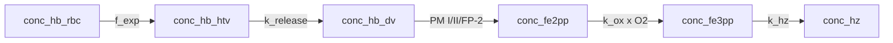

# Model 5

**Code:** [`haem_kinetics/models/model5.py`](../../haem_kinetics/models/model5.py)  
**Up:** [Model index](../models.md) · **Prev:** [Model 4](model4.md) · **Next:** [Model 6](model6.md)

Model 4b lumen chemistry (`f_exp`, `s_PM(t)`, native-competent lumped haem release, `k_hz · [Fe3]`) plus an **inaccessible pre-lumen cargo pool**: cytostomal / HTV haemoglobin that scores as assay Hb but is not mixed with mature vacuolar proteases until first-order release. Model 4a’s globin pool is not carried: it never accumulated, so Model 5 keeps 4b’s single lumen Hb state.

This step **supersedes** an attempted native-Hb `kcat_app` reconstruction. That conversion still lacks moles of enzyme; it was not used as a ladder parameter. Arithmetic: [enzyme_kinetics.md](../enzyme_kinetics.md#attempted-native-hb-kcat_app-reconstruction).

Plots use **assay Hb** (`conc_hb_htv + conc_hb_dv`): Garnie fractionation cannot tell HTV cargo from lumen Hb.

---

## What changed vs Model 4b (and why)

**Problem in Model 4:** peptide-provisional native `Vmax` is still ≫ uptake, so lumen Hb collapses (~0 vs assay ~1–2 fg). 4a vs 4b does not change that (globin does not accumulate). The missing biology is **delivery**, not another `kcat`. Trophozoite uptake is cytostome → double-membrane HTVs → outer fusion with the DV → inner (PVM-derived) vesicle lysed before Hb mixes with soluble proteases (Yayon 1984; Klemba *JCB* 2004; Nasamu 2020). Klonis et al. 2007: cytostomal vesicles are not measurably acidic (ER-like pH), not DV pH 5.4–5.5; catabolism starts after delivery. Assay Hb (protein-bound Fe) includes that cargo; HTVs are **not** Garnie pHrodo lumen.

**Change (one mechanism):** `f_exp` delivers into inaccessible cargo `conc_hb_htv`. First-order `k_release` feeds lumen Hb. Lumen ODEs are otherwise Model 4b (PM I/II/FP-2 native rate, nick and haem release lumped).

| Item | Model 4b | Model 5 |
|------|----------|---------|
| Uptake destination | lumen Hb | **HTV cargo** |
| Lumen proteases | PM I/II/FP-2 native rate only (lumped) | Unchanged |
| Assay Hb | `conc_hb_dv` | **HTV + lumen Hb** |
| `k_release` | — | Klemba delivery bound (provisional) |

**Not this step:**

- A delay fitted so Dd2 Hb sits at 1.9 fg.
- A reconstructed native-Hb `kcat` (still no `[E]` in the cited assays).
- Proteases inside HTVs (Elliott *PNAS* 2008; Klonis 2007 argues catabolism after delivery).
- A vesicle-number cap to flatten Hb vs ramping `f_exp`.
- Lipid / crystal-competent Fe3 (basal Hm).

---

## Process schematic



---

## Volume bookkeeping

HTV cargo is **not** in Garnie lumen `V_DV(t)`. It is an amount (moles/cell), encoded as molarity at `V_ref = 1 fL` so `fg = C · V_ref` always. No lumen dilution on `conc_hb_htv`. Lumen species stay M at `V_DV(t)` as in Models 1–4.

`AMOUNT_SPECIES` in [`base.py`](../../haem_kinetics/models/base.py) skips lumen scaling in `_prepare_y0` and converts those columns with `V_ref`.

---

## Governing equations

Shared `V_DV(t)`, dilution (lumen only), `f_exp` uptake, and 4b `v_dig`: [models.md](../models.md#shared-framework), [model4.md](model4.md). Model 5 addition:

```text
n_HTV = C_htv · V_ref
v_up,mol     = v_up · V_DV(t)          # same f_exp mole rate as Model 2–5
v_release,mol = k_release · n_HTV

d C_htv / dt   = v_up,mol / V_ref − k_release · C_htv
d [Hb]_lumen/dt = v_release,mol / V_DV(t) − v_dig + dil([Hb]_lumen)
```

Fe2 / Fe3 / Hz ODEs unchanged from 4b (`v_dig` is the native-competent lumped rate). Host depletion still uses `v_up · V_DV(t) / V_RBC`.

Init `[Hb, Fe2, Fe3, Hz]` seeds **HTV** (`conc_hb_dv = 0`). A lumen seed would be eaten by peptide-scale `Vmax` before 20 h.

---

## Parameters (Model 5–specific)

| Constant | Value | Units | Source |
|----------|------:|-------|--------|
| `k_htv_release` | ln(2)/20 ≈ 0.0347 | min⁻¹ | Klemba *JCB* 2004: cytostomal delivery `t½` **&lt; 20 min** from PM biosynthesis/maturation (`t½ ≈ 20 min`; Francis 1997; Banerjee 2003). **Provisional:** the paper’s figure is an upper bound on `t½`; inner-vesicle lysis is lumped, not separately timed. **Not** `τ ≈ 1.9 fg / 3 fg h⁻¹`. |

---

## State variables

| Symbol | Meaning |
|--------|---------|
| `conc_hb_htv` | Inaccessible HTV / inner-vesicle cargo (amount as M at `V_ref`) |
| `conc_hb_dv` | Lumen Hb (native-competent lumped digestion; M at `V_DV(t)`) |
| `conc_fe2pp`, `conc_fe3pp`, `conc_hz` | Same as Model 4b |
| Assay Hb | HTV + lumen Hb |

---

## Assumptions

- Klonis 2007 pH: no mature protease activity on cargo until DV delivery. Elliott 2008 pre-FV digestion is a competing hypothesis for a later numbered model if this pool overshoots.
- First-order `k_release` lumps traffic + fusion + inner-membrane lysis. If lumen `Vmax` remains huge, assay Hb ≈ the transit pool `n_HTV ≈ v_up / k_release`.
- Because `f_exp` ramps, standing Hb is predicted to **rise with flux**, not sit flat at 1.9 fg. That is an accountable prediction, not a reason to add a vesicle-number cap here.

---

## Known behaviour / issues

- Lumen Hb collapses (~0). Assay Hb is the HTV transit pool: ~0.52 fg at 20 h → ~1.16 fg at 44 h (rises with `f_exp`, not a flat 1.9 fg). That is the accountable prediction of first-order release with the Klemba bound.
- Hb χ²_red improves vs 4b (37 → 10) but the pool is still low vs assay (mean signed error −1.0 fg). Do not retune `k_release` to close that gap.
- Hz is slightly delayed vs 4b (RMSE 11.63 → 12.27) because cargo spends ~20 min `t½` before lumen proteases. DV Fe is unchanged.
- Hm remains drained by `k_hz · [Fe3]` — [Model 6](model6.md) is the next accountable step (lipid partition, not `φ`).
- Native PM I `kcat` is still peptide-provisional; this step does not invent a native turnover.

---

## Fit vs Garnie Dd2

Protocol and definitions: [models.md](../models.md#fit-vs-garnie-dd2-tracking).

| Series | RMSE (fg/cell) | MAE | mean signed error | χ²_red | n |
|--------|---------------:|----:|-----:|-------:|--:|
| Hb | 1.03 | 1.00 | −1.00 | 10.43 | 9 |
| Hm | 3.38 | 3.11 | −3.11 | 232 | 9 |
| Hz | 12.27 | 8.04 | −6.99 | 0.62 | 9 |
| DV Fe | 15.89 | 11.11 | −11.11 | 1.17 | 9 |

**Vs Model 4b:** Hb moves (RMSE 1.91 → 1.03) because the assay now sees the inaccessible cargo. Lumen chemistry is 4b (native-competent, lumped); Hm is the same and internalized Fe is the same. Hz lags slightly (vesicle→lumen delay). Success for this step is the HTV topology with a cited `k_release`, not a still-low Hb score used to justify fitting the delay or adding a vesicle-number cap. 4a’s globin pool is omitted because it did not accumulate.

---

## How to run

```python
from haem_kinetics.models.model5 import Model5

model = Model5()
model.run(
    t=[0, 1700],
    init=[0.018, 0.0, 0.0, 0.36],
    t_eval=range(0, 1700, 20),
    plot='examples/model5.png',
)
```

---

## References

- Klemba M, Beatty W, Gluzman I, Goldberg DE. Trafficking of plasmepsin II to the food vacuole of the malaria parasite *Plasmodium falciparum*. *J. Cell Biol.* (2004) 164:47–56. [doi:10.1083/jcb.200307147](https://doi.org/10.1083/jcb.200307147)
- Klonis N, Tan OLP, Jackson K, Goldberg D, Klemba M, Tilley L. Evaluation of pH during cytostomal endocytosis and vacuolar catabolism of haemoglobin in *Plasmodium falciparum*. *Biochem. J.* (2007) 407:343–354. [doi:10.1042/BJ20070934](https://doi.org/10.1042/BJ20070934) — cytostomal vesicles not measurably acidic (ER-like) until DV fusion; DV pH 5.4–5.5.
- Yayon A, Timberg R, Friedman S, Ginsburg H. Effects of chloroquine on the feeding mechanism of the intraerythrocytic human malarial parasite *Plasmodium falciparum*. *J. Protozool.* (1984) 31:367–372.
- Nasamu AS, Polino AJ, Istvan ES, Goldberg DE. Malaria parasite plasmepsins: more than just plain old degradative pepsins. *J. Biol. Chem.* (2020) 295:8425–8441. [doi:10.1074/jbc.REV120.009309](https://doi.org/10.1074/jbc.REV120.009309)
- Francis SE, Banerjee R, Goldberg DE. Biosynthesis and maturation of plasmepsins. Cited via Klemba 2004 (`t½ ≈ 20 min`).
- Garnie LF, Egan TJ, Wicht KJ. *Commun. Biol.* (2025) 8:1564. [doi:10.1038/s42003-025-08991-z](https://doi.org/10.1038/s42003-025-08991-z)
- Native-Hb `kcat` gap (not this step): [enzyme_kinetics.md](../enzyme_kinetics.md)
