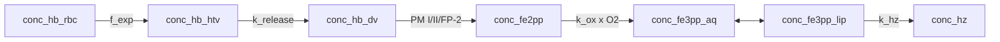

# Model 7

**Code:** [`haem_kinetics/models/model7.py`](../../haem_kinetics/models/model7.py)  
**Up:** [Model index](../models.md) · **Prev:** [Model 6](model6.md) · **Next:** [Model 8](model8.md)

Model 6 chemistry (HTV cargo, `k_release(t) ∝ s_PM`, 4b lumen proteases, `f_exp`) plus **aqueous ⇄ lipid Fe(III) partition**. Haemozoin forms from the **lipid** pool at literature `k_hz`. Assay free haem is aq + lip.

---

## What changed vs Model 6 (and why)

**Problem in Models 1–6:** a single Fe(III) pool crystallizes at `k_hz = 0.12 min⁻¹`. That number is from **lipid-mediated** β-haematin assays (Egan et al. *Malar. J.* 2012). Applying it to bulk aqueous Fe(III) drains assay Hm (~0 vs Garnie basal free haem). Multiplying `k_hz` by an aqueous fraction `φ ≈ 0.13` (legacy Model 2) treats lipid as an **inhibitor** of crystallization — the wrong chemical sign.

**Change (one mechanism):** Fe(III)PPIX partitions between aqueous lumen and lipid nanospheres. Crystallization acts on the lipid-associated pool at the **full** assay `k_hz` (no `φ`).

| Item | Model 6 | Model 7 |
|------|---------|---------|
| Fe(III) | one pool `conc_fe3pp` | **`conc_fe3pp_aq` ⇄ `conc_fe3pp_lip`** |
| `v_hz` | `k_hz · [Fe3]` | `k_hz · [Fe3]_lip` |
| Assay Hm | `conc_fe3pp` | **aq + lip** |
| HTV / proteases | Model 6 | Unchanged |

**Not this step:**

- `φ` as a rate multiplier on `k_hz`.
- A crystal-competent (`xtal`) sub-pool of lipid Fe — [Model 8](model8.md).
- Fitting `k_hz` or `K_partition` to Garnie basal Hm.

---

## Process schematic



Assay **Hb** (plotted): `conc_hb_htv + conc_hb_dv`. Assay **Hm**: `conc_fe3pp_aq + conc_fe3pp_lip`.

---

## Governing equations

HTV, lumen digestion, oxidation: [model6.md](model6.md), [model5.md](model5.md), [model4.md](model4.md). Model 7 addition:

```text
φ = (1 − f_lip) / (1 + f_lip + f_lip · K_partition)
K_eff = (1 − φ) / φ = [Fe3]_lip / [Fe3]_aq |eq

v_ex = k_lipid_ex · ( [Fe3]_aq − [Fe3]_lip / K_eff )
v_hz = k_hz · [Fe3]_lip

d [Fe3]_aq / dt  = v_ox − v_red − v_ex + dil([Fe3]_aq)
d [Fe3]_lip / dt = v_ex − v_hz + dil([Fe3]_lip)
d [Hz] / dt      = v_hz + dil([Hz])
```

Both Fe3 pools are lumen-basis M at `V_DV(t)` with dilution. `f_lip` is a constant fraction of current lumen volume. `k_lipid_ex = 50 min⁻¹` is fast (near-equilibrium partition), not fit to Garnie Hm.

Init `[Hb, Fe2, Fe3, Hz]` seeds HTV and **aqueous** Fe3 (lip = 0).

---

## Parameters (Model 7–specific)

| Constant | Value | Units | Source |
|----------|------:|-------|--------|
| `f_lip` | 0.016 | — | Lipid nanosphere volume fraction vs DV |
| `K_partition` | 398 | — | Fe(III)PPIX lipid/aqueous partition |
| `K_eff` | ≈ 6.50 | — | `[Fe3]_lip / [Fe3]_aq` at equilibrium |
| `k_lipid_ex` | 50 | min⁻¹ | Aqueous ⇄ lipid exchange (fast; near eq.) |
| `k_hz` | 0.12 | min⁻¹ | Egan lipid-mediated β-haematin, on **lipid** pool |

---

## State variables

| Symbol | Meaning |
|--------|---------|
| `conc_hb_htv`, `conc_hb_dv` | Same as Model 6 |
| `conc_fe2pp` | Fe(II)PPIX |
| `conc_fe3pp_aq` | Aqueous Fe(III)PPIX |
| `conc_fe3pp_lip` | Lipid-associated non-Hz Fe(III) |
| `conc_hz` | Haemozoin |
| Assay Hb | HTV + lumen |
| Assay Hm | aq + lip |

---

## Assumptions

- Lipids both sequester Fe(III) **and** provide the crystallizing environment.
- Fast exchange keeps aq/lip near `K_eff`.
- Assay free haem includes lipid-associated Fe(III) that has not crystallized.

---

## Known behaviour / issues

- With full `k_hz` on the lipid pool, lipid Fe³⁺ still crystallizes quickly. Assay Hm (`aq+lip`) remains far below Garnie basal (χ²_red 207 vs 217 on Model 6). That is an accountable result of this chemistry, not a reason to add `φ` in this step. [Model 8](model8.md) is the next accountable step (interfacial Fe(III), not a fitted `k_hz`).
- Hb / HTV lysis clock is Model 6 (`k_release ∝ s_PM`).

---

## Fit vs Garnie Dd2

Protocol and definitions: [models.md](../models.md#fit-vs-garnie-dd2-tracking). Recompute with `python examples/run.py`.

| Series | RMSE (fg/cell) | MAE | mean signed error | χ²_red | n |
|--------|---------------:|----:|-----:|-------:|--:|
| Hb | 0.33 | 0.25 | +0.14 | 0.74 | 9 |
| Hm | 3.13 | 2.88 | −2.88 | 207 | 9 |
| Hz | 3.54 | 2.53 | +2.53 | 0.22 | 9 |
| DV Fe | 2.56 | 1.98 | −0.21 | 0.09 | 9 |

**Vs Model 6:** Hb and DV Fe are unchanged (same HTV cargo and internalized inventory). Hm moves only a little (RMSE 3.20 → 3.13, χ²_red 217 → 207): lipid Fe³⁺ still crystallizes at full literature `k_hz`, so assay Hm (`aq+lip`) remains far below Garnie basal. Hz is slightly less high (RMSE 3.59 → 3.54). Success for this step is the Egan sign of lipid (promotes Hz; do not multiply `k_hz` by `φ`), not a still-low Hm score used to justify a fitted `k_hz` here. Interfacial Fe is [Model 8](model8.md).

---

## How to run

```python
from haem_kinetics.models.model7 import Model7

model = Model7()
model.run(
    t=[0, 1700],
    init=[0.018, 0.0, 0.0, 0.36],
    t_eval=range(0, 1700, 20),
    plot='examples/model7.png',
)
```

---

## References

- Egan TJ, Chen JY, de Villiers KA, et al. Haemozoin (β-haematin) biomineralization requires both a lipid medium and an accelerating structure to promote haem dimerization. *Malaria Journal* (2012) 11:337. [doi:10.1186/1475-2875-11-337](https://doi.org/10.1186/1475-2875-11-337)
- Garnie LF, Egan TJ, Wicht KJ. *Commun. Biol.* (2025) 8:1564. [doi:10.1038/s42003-025-08991-z](https://doi.org/10.1038/s42003-025-08991-z)
