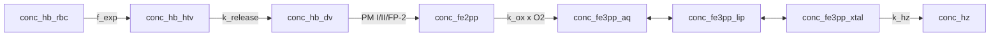

# Model 8

**Code:** [`haem_kinetics/models/model8.py`](../../haem_kinetics/models/model8.py)  
**Up:** [Model index](../models.md) · **Prev:** [Model 7](model7.md) · **Next:** [Model 9](model9.md)

Model 7 chemistry (HTV cargo, `k_release(t) ∝ s_PM`, 4b lumen proteases, aq ⇄ lip Fe(III)) plus an **interfacial / crystal-competent** Fe(III) pool. Haemozoin forms from the **interface** at literature `k_hz`. Assay free haem is aq + lip + xtal.

---

## What changed vs Model 7 (and why)

**Problem in Model 7:** `v_hz = k_hz · [Fe3]_lip` at full literature `k_hz`. Fast aqueous ⇄ lipid partition only **relocates** haem. At quasi-steady state `[Hm] ≈ v_prod / k_eff` with `k_eff ≈ 0.10 min⁻¹`, so assay Hm still drains. Thesis Model 3 raised Hm by crystallizing from the **aqueous** fraction only (`φ`); that treats lipid as an inhibitor of Hz — the wrong chemical sign.

**Change (one mechanism):** β-haematin nucleates and grows at the **lipid–water interface**, not throughout the NLB core (Egan et al. *Malar. J.* 2012: a lipid medium **and** an accelerating structure). Hydrophobic Fe(III)PPIX enters bulk lipid (assay Hm). Only the interfacial fraction is on-path to the head-to-tail dimer.

| Item | Model 7 | Model 8 |
|------|---------|---------|
| Fe(III) | aq ⇄ lip → Hz | aq ⇄ lip ⇄ **xtal** → Hz |
| `v_hz` | `k_hz · [Fe3]_lip` | `k_hz · [Fe3]_xtal` |
| Assay Hm | aq + lip | **aq + lip + xtal** |
| HTV / proteases | Model 7 | Unchanged |

**Not this step:**

- `φ` as a rate multiplier on `k_hz`.
- Fitting `K_xtal` or `k_hz` to Garnie basal Hm.
- A solubility / supersaturation threshold.
- Surface-area-limited growth (`v_hz ∝ A_Hz`). That is [Model 9](model9.md).

---

## Process schematic



Assay **Hb** (plotted): `conc_hb_htv + conc_hb_dv`. Assay **Hm**: `conc_fe3pp_aq + conc_fe3pp_lip + conc_fe3pp_xtal` (all still non-crystalline Fe(III)PPIX). The Hm raise must come from slower drain of bulk lipid, not from hiding xtal in the plot.

---

## Governing equations

HTV, lumen digestion, oxidation, aq ⇄ lip: [model7.md](model7.md). Model 8 addition:

```text
v_lip↔xtal = k_xtal_ex · ( [Fe3]_lip − [Fe3]_xtal / K_xtal )
v_hz       = k_hz · [Fe3]_xtal

d [Fe3]_lip / dt  = v_ex − v_lip↔xtal + dil([Fe3]_lip)
d [Fe3]_xtal / dt = v_lip↔xtal − v_hz + dil([Fe3]_xtal)
d [Hz] / dt       = v_hz + dil([Hz])
```

All three Fe3 pools are lumen-basis M at `V_DV(t)` with dilution. Init `[Hb, Fe2, Fe3, Hz]` seeds HTV and **aqueous** Fe3 (lip = xtal = 0).

QSS (why this can hold Hm when Model 7 cannot): `k_eff ≈ k_hz · K_xtal · lip/Hm`. With `K_xtal = 3δ/R = 0.08`, standing Hm is ~10× Model 7 without slowing literature `k_hz`.

---

## Why `K_xtal = 0.08` and `k_xtal_ex = 5 min⁻¹`

These numbers entered the repo with the **legacy** Model 6 ladder and had **no assay citation**. `K_xtal` is the parameter that sets standing Hm (`[Hm] ≈ v_prod / (k_hz · K_xtal · …)`); it was almost certainly chosen so older Combrink-style plots looked right. It was **not** re-fit to Garnie 2025.

We keep the same numerical `K_xtal` because it is exactly the thin-shell volume ratio for a cited size pair, not because it minimizes χ².

```text
K_xtal = [Fe3]_xtal / [Fe3]_lip |eq ≈ 3δ / R
```

for a spherical NLB of radius `R` with interfacial shell thickness `δ` (`δ ≪ R`). Code: `K_xtal = 3 · interface_shell_m / nlb_radius_m`.

| Input | Value | Why this, not a Garnie fit |
|-------|------:|----------------------------|
| `R` | 150 nm | Jackson *Mol. Microbiol.* 2004 and Pisciotta *Biochem. J.* 2007: DV-associated NLBs are **a few hundred nm**. We take a 300 nm diameter (mid that phrase). Larger droplets (smaller `K_xtal`) would park **more** Hm. |
| `δ` | 4 nm | Kapishnikov *PNAS* 2012 measured DV membrane thickness **~4 nm** (bilayer; some patches ~8 nm). Used here as the **interfacial-film scale** for a catalytic lipid–water layer, not a claim that Kapishnikov’s DV inner membrane *is* the NLB surface. |
| `K_xtal` | **0.08** | `3 × 4 / 150`. A 2 nm monolayer on the same `R` would give **0.04** and raise standing Hm further. We do not pick `δ` to sit on 3–6 fg. |

**Kapishnikov vs Egan.** Egan 2012: Hz at a lipid–water interface (NLB / lipid medium + accelerating structure). Kapishnikov 2012: nucleation on the **inner DV membrane**, crystals growing in aqueous lumen, no lipid shroud resolved at ~25–30 nm. Model 8 is the Egan/Pisciotta NLB-surface encoding. If Kapishnikov is the right geometry, `K_xtal` should be membrane-leaflet volume vs lipid (or lumen) volume — a later numbered model, not a retune of 0.08.

**`k_xtal_ex = 5 min⁻¹`** is the same class of constant as `k_lipid_ex = 50 min⁻¹`: large compared with `k_hz` (0.12 min⁻¹) so lip ⇄ xtal sits near `K_xtal`. There is no measured exchange rate. Standing Hm is insensitive to this `k` provided `k_xtal_ex ≫ k_hz`. Do not fit it.

Do **not** minimize Garnie χ² by changing `K_xtal`. Surface-area growth is [Model 9](model9.md). If a different cited `(δ, R)` overshoots after that, the next hypothesis is Kapishnikov membrane nucleation.

---

## Parameters (Model 8–specific)

| Constant | Value | Units | Source |
|----------|------:|-------|--------|
| `R` (`nlb_radius_m`) | 150 | nm | Jackson 2004 / Pisciotta 2007; 300 nm diameter |
| `δ` (`interface_shell_m`) | 4 | nm | Kapishnikov 2012 bilayer thickness (film scale) |
| `K_xtal` | 0.08 | — | `3δ/R` (derived; not an independent fit) |
| `k_xtal_ex` | 5 | min⁻¹ | Fast vs `k_hz` (near-eq placeholder; not measured) |
| `k_hz` | 0.12 | min⁻¹ | Egan lipid-mediated β-haematin, on the **interfacial** pool |

---

## State variables

| Symbol | Meaning |
|--------|---------|
| `conc_hb_htv`, `conc_hb_dv` | Same as Model 6 |
| `conc_fe2pp` | Fe(II)PPIX |
| `conc_fe3pp_aq` | Aqueous Fe(III)PPIX |
| `conc_fe3pp_lip` | Bulk NLB (non-interfacial) Fe(III) |
| `conc_fe3pp_xtal` | Interfacial / crystal-competent Fe(III), still non-crystalline |
| `conc_hz` | Haemozoin |
| Assay Hb | HTV + lumen |
| Assay Hm | aq + lip + xtal |

---

## Assumptions

- Hz forms at the lipid–water interface, not in the NLB core.
- Fast lip ⇄ xtal exchange (`k_xtal_ex ≫ k_hz`) keeps the interfacial fraction near `K_xtal = 3δ/R`.
- Assay free haem includes interfacial Fe(III) that has not entered the crystal lattice.

---

## Known behaviour / issues

- `K_xtal` is `3δ/R` from cited NLB size and film thickness (legacy 0.08 recovered, not re-fit to Garnie). Do not retune it to close remaining Hm χ². A 2 nm monolayer on the same `R` would be 0.04 and park more Hm.
- Hb / HTV lysis clock is Model 6. Hz is delayed vs Model 7 because more Fe remains non-crystalline.

---

## Fit vs Garnie Dd2

Protocol and definitions: [models.md](../models.md#fit-vs-garnie-dd2-tracking). Recompute with `python examples/run.py`.

| Series | RMSE (fg/cell) | MAE | mean signed error | χ²_red | n |
|--------|---------------:|----:|-----:|-------:|--:|
| Hb | 0.33 | 0.25 | +0.14 | 0.74 | 9 |
| Hm | 3.31 | 2.69 | +2.60 | 102 | 9 |
| Hz | 4.10 | 3.27 | −2.95 | 0.17 | 9 |
| DV Fe | 2.56 | 1.98 | −0.21 | 0.09 | 9 |

**Vs Model 7:** Hb and DV Fe are unchanged. Hm signed error flips from −2.88 to +2.60 fg (high, not drained): bulk NLB haem is no longer the `k_hz` substrate. RMSE barely moves (3.13 → 3.31) because extra 2b delivery overfills assay Hm; χ²_red 207 → 102. Hz signed error flips from +2.53 to −2.95. Success for this step is the interface topology with `K_xtal = 3δ/R`, not a still-off χ² used to justify fitting `K_xtal` or adding surface-area growth here. The old interfacial Hm fit (RMSE 0.72) was on the short Model 2a inventory.

---

## How to run

```python
from haem_kinetics.models.model8 import Model8

model = Model8()
model.run(
    t=[0, 1700],
    init=[0.018, 0.0, 0.0, 0.36],
    t_eval=range(0, 1700, 20),
    plot='examples/model8.png',
)
```

---

## References

- Egan TJ, Chen JY, de Villiers KA, et al. Haemozoin (β-haematin) biomineralization requires both a lipid medium and an accelerating structure to promote haem dimerization. *Malaria Journal* (2012) 11:337. [doi:10.1186/1475-2875-11-337](https://doi.org/10.1186/1475-2875-11-337)
- Jackson KE, Klonis N, Ferguson DJP, Adisa A, Dogovski C, Tilley L. Food vacuole-associated lipid bodies and heterogeneous lipid environments in the malaria parasite, *Plasmodium falciparum*. *Mol. Microbiol.* (2004) 54:109–122. [doi:10.1111/j.1365-2958.2004.04284.x](https://doi.org/10.1111/j.1365-2958.2004.04284.x)
- Pisciotta JM, Coppens I, Tripathi AK, et al. The role of neutral lipid nanospheres in *Plasmodium falciparum* haem crystallization. *Biochem. J.* (2007) 402:197–204. [doi:10.1042/bj20060986](https://doi.org/10.1042/bj20060986)
- Kapishnikov S, Weiner A, Shimoni E, et al. Oriented nucleation of hemozoin at the digestive vacuole membrane in *Plasmodium falciparum*. *Proc. Natl. Acad. Sci. USA* (2012) 109:11188–11193. [doi:10.1073/pnas.1118120109](https://doi.org/10.1073/pnas.1118120109)
- Garnie LF, Egan TJ, Wicht KJ. *Commun. Biol.* (2025) 8:1564. [doi:10.1038/s42003-025-08991-z](https://doi.org/10.1038/s42003-025-08991-z)
