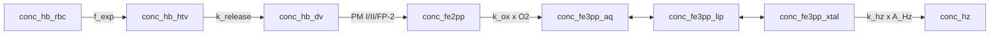

# Model 9

**Code:** [`haem_kinetics/models/model9.py`](../../haem_kinetics/models/model9.py)  
**Up:** [Model index](../models.md) · **Prev:** [Model 8](model8.md) · **Next:** [Model 10](model10.md) (what-if)

Model 8 chemistry (HTV cargo, `k_release(t) ∝ s_PM`, 4b lumen proteases, aq ⇄ lip ⇄ xtal) plus **crystal-area growth**. Haemozoin still forms from the interfacial pool at literature `k_hz`, now scaled by growing Hz surface.

---

## What changed vs Model 8 (and why)

**Problem in Model 8:** `v_hz = k_hz · [Fe3]_xtal` is first-order in the interface only. Assay Hm sits high (signed **+2.60 fg**) and Hz low (signed **−2.95 fg**): the same iron is parked in non-crystalline Fe(III) instead of crystal. Egan’s lipid-mediated β-haematin needs a lipid medium **and** an accelerating structure. A first-order `k_hz` does not grow that structure.

**Change (one mechanism):** crystallization rate scales with crystal surface area. For a sphere, area ∝ volume^{2/3} ∝ amount^{2/3}:

```text
v_hz = k_hz · [Fe3]_xtal · (n_Hz / n_Hz_start)^{2/3}
```

`n_Hz = [Hz] · V_DV(t)` (amount). Lumen concentration is not used: dilution must not fake a change in crystal size. `n_Hz_start` is the protocol seed, `0.36` M at `V_ref` ≈ **20 fg**. At `t = 0` the area factor is 1 (same rate as Model 8). The `2/3` exponent is sphere geometry, not a Garnie fit.

| Item | Model 8 | Model 9 |
|------|---------|---------|
| Fe(III) | aq ⇄ lip ⇄ xtal → Hz | Unchanged topology |
| `v_hz` | `k_hz · [Fe3]_xtal` | **`k_hz · [Fe3]_xtal · (n_Hz / n_Hz_start)^{2/3}`** |
| `k_hz`, `K_xtal` | literature / `3δ/R` | **Unchanged** |
| `f_exp` | Model 2b two-phase | Unchanged |
| Assay Hm | aq + lip + xtal | Unchanged |

**Not this step:**

- Fitting `k_hz`, `K_xtal`, or the exponent to Garnie Hm.
- Changing `f_exp`.
- Restoring `φ`.
- The what-if plateau `k_release` scale and `K_xtal = 0.10` ([Model 10](model10.md)).

Success is the area law with the 20 fg seed and sphere `2/3`. A still-off Hm χ² is not a reason to fit the exponent.

---

## Process schematic



Assay **Hb**: `conc_hb_htv + conc_hb_dv`. Assay **Hm**: `conc_fe3pp_aq + conc_fe3pp_lip + conc_fe3pp_xtal`.

---

## Governing equations

HTV, lumen digestion, oxidation, aq ⇄ lip ⇄ xtal: [model8.md](model8.md). Model 9 replaces only `v_hz`:

```text
n_Hz       = [Hz] · V_DV(t)
n_Hz_start = 0.36 · V_ref
v_hz       = k_hz · [Fe3]_xtal · (n_Hz / n_Hz_start)^{2/3}

d [Fe3]_xtal / dt = v_lip↔xtal − v_hz + dil([Fe3]_xtal)
d [Hz] / dt       = v_hz + dil([Hz])
```

`Hz_start` is the existing init Hz (~20 fg), not a fitted nucleation seed. Early half-time cost is none: the factor is 1 at start.

---

## Parameters (Model 9–specific)

| Constant | Value | Units | Source |
|----------|------:|-------|--------|
| `n_Hz_start` | `0.36 · V_ref` | mol | Protocol init Hz (~20 fg); not a fit |
| exponent | `2/3` | — | Sphere area ∝ volume^{2/3} |
| `k_hz` | 0.12 | min⁻¹ | Egan lipid-mediated β-haematin (unchanged) |
| `K_xtal` | 0.08 | — | `3δ/R` from Model 8 (unchanged) |

---

## Assumptions

- Growing Hz is treated as a sphere for the area–amount relation. Real β-haematin is faceted; `2/3` is the isotropic geometric default, not a crystal-habit measurement.
- Amount (`C · V_DV(t)`), not lumen concentration, is the size proxy.
- The 20 fg seed is already present at the 16 h offset (same init as every other model).

---

## Known behaviour / issues

- Hb and DV Fe match Model 8 (uptake and lysis unchanged).
- Hm and Hz move because `v_hz` grows with crystal area (Hm signed +2.60 → 0.00; Hz signed −2.95 → −0.35). Do not retune `k_hz` or the exponent to chase the remaining Hm χ².
- At ~90 fg Hz the factor is `(90/20)^{2/3} ≈ 2.7`.

---

## Fit vs Garnie Dd2

Protocol and definitions: [models.md](../models.md#fit-vs-garnie-dd2-tracking). Recompute with `python examples/run.py`.

| Series | RMSE (fg/cell) | MAE | mean signed error | χ²_red | n |
|--------|---------------:|----:|-----:|-------:|--:|
| Hb | 0.33 | 0.25 | +0.14 | 0.74 | 9 |
| Hm | 1.14 | 0.88 | +0.00 | 53.3 | 9 |
| Hz | 2.30 | 1.92 | −0.35 | 0.08 | 9 |
| DV Fe | 2.56 | 1.98 | −0.21 | 0.09 | 9 |

**Vs Model 8:** Hb and DV Fe match. Hm RMSE 3.31 → 1.14, signed +2.60 → 0.00, χ²_red 102 → 53. Hz RMSE 4.10 → 2.30, signed −2.95 → −0.35. Success for this step is the area law, not the remaining Hm χ² used to justify a fitted exponent.

---

## How to run

```python
from haem_kinetics.models.model9 import Model9

model = Model9()
model.run(
    t=[0, 1700],
    init=[0.018, 0.0, 0.0, 0.36],
    t_eval=range(0, 1700, 20),
    plot='examples/model9.png',
)
```

---

## References

- Egan accelerating structure (what Model 8 deferred): [model8.md](model8.md)
- Egan TJ, Chen JY, de Villiers KA, et al. Haemozoin (β-haematin) biomineralization requires both a lipid medium and an accelerating structure to promote haem dimerization. *Malaria Journal* (2012) 11:337. [doi:10.1186/1475-2875-11-337](https://doi.org/10.1186/1475-2875-11-337)
- Garnie LF, Egan TJ, Wicht KJ. *Commun. Biol.* (2025) 8:1564. [doi:10.1038/s42003-025-08991-z](https://doi.org/10.1038/s42003-025-08991-z)
